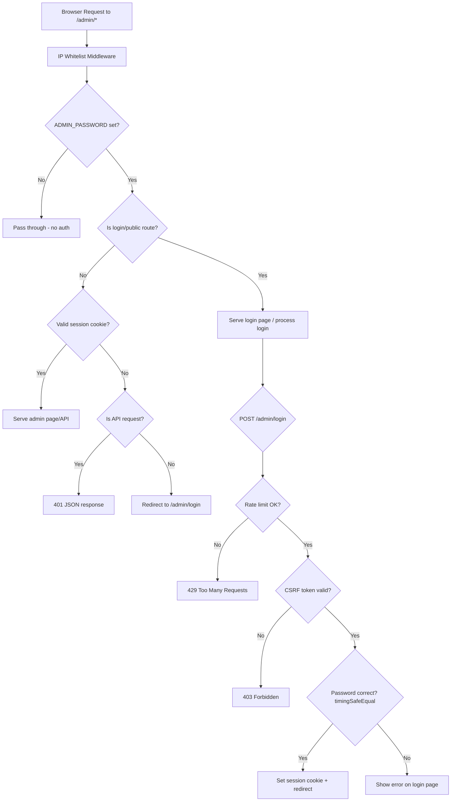

# Design Document: Admin Authentication

## Overview

This feature adds password-based authentication to the admin panel (`/admin/*`). The current setup relies solely on an optional IP whitelist. This design introduces a login page, session cookies, route-protection middleware, logout, and security hardening (rate limiting, constant-time comparison, CSRF tokens).

The design is intentionally stateless on the server side: session tokens are HMAC-signed values that the server can verify without a session store. Rate-limiting state is kept in a simple in-memory Map with TTL-based cleanup, which is acceptable for a single-process Node.js server.

### Key Design Decisions

1. **Stateless sessions via HMAC** — No session store needed. The server signs a token with a secret derived from `ADMIN_PASSWORD` itself (or a dedicated `SESSION_SECRET` if provided). The cookie contains `timestamp.signature`, and the server re-computes the signature to validate.
2. **Graceful degradation** — When `ADMIN_PASSWORD` is unset or empty, the auth middleware is a no-op, preserving the current open-access behavior with a logged warning.
3. **Middleware ordering** — Auth middleware is registered after the existing IP whitelist middleware on `/admin` so both layers apply when IP restrictions are configured.
4. **CSRF via double-submit pattern** — A random token is generated per login page load, embedded in a hidden form field, and stored in a short-lived cookie. The server validates the two match on POST.
5. **No new dependencies** — Node.js `crypto` module provides HMAC, constant-time comparison (`timingSafeEqual`), and random bytes. No external auth library needed.

## Architecture



## Components and Interfaces

### 1. `src/admin-auth.js` — Auth Module

New module containing all authentication logic. Exports middleware and helpers.

```js
// Exported interface
module.exports = {
  createAuthMiddleware(adminPassword, options),  // Returns Express middleware
  createLoginRouter(adminPassword, options),     // Returns Express Router for login/logout
  generateCsrfToken(),                           // Returns { token, cookie } pair
  validateCsrfToken(req),                        // Returns boolean
  signSessionToken(secret),                      // Returns signed token string
  verifySessionToken(token, secret),             // Returns boolean
  createRateLimiter(maxAttempts, windowMs),       // Returns rate limiter instance
};
```

**`createAuthMiddleware(adminPassword, options)`**
- If `adminPassword` is falsy, returns a no-op middleware that calls `next()`.
- Otherwise, returns middleware that:
  - Skips `/admin/login` (GET and POST) and static assets for the login page.
  - Reads the session cookie, verifies the HMAC signature.
  - For HTML requests: redirects to `/admin/login` on failure.
  - For `/admin/api/*` requests: returns `401 { error: 'Unauthorized' }`.

**`createLoginRouter(adminPassword, options)`**
- `GET /admin/login` — Serves the login HTML page with an embedded CSRF token.
- `POST /admin/login` — Validates CSRF, checks rate limit, compares password with `crypto.timingSafeEqual`, sets session cookie on success, returns error on failure.
- `POST /admin/logout` — Clears the session cookie, redirects to `/admin/login`.

**`createRateLimiter(maxAttempts, windowMs)`**
- Returns an object with `check(ip)` and `record(ip)` methods.
- Uses an in-memory `Map<ip, { count, firstAttempt }>`.
- Entries expire after `windowMs` (15 minutes).
- Periodic cleanup every 5 minutes to prevent memory leaks.

### 2. `src/config.js` — Configuration Changes

Add `ADMIN_PASSWORD` and optional `SESSION_SECRET` to the config object:

```js
admin: {
  password: process.env.ADMIN_PASSWORD || null,
  sessionSecret: process.env.SESSION_SECRET || process.env.ADMIN_PASSWORD || null,
}
```

Log a warning at startup when `ADMIN_PASSWORD` is not set or empty.

### 3. `src/server.js` — Integration

Register the auth middleware and login router after the IP whitelist middleware:

```js
const { createAuthMiddleware, createLoginRouter } = require('./admin-auth');

// After IP whitelist middleware...
app.use('/admin', createAuthMiddleware(config.admin.password, {
  sessionSecret: config.admin.sessionSecret,
  cookieName: 'admin_session',
}));
app.use(createLoginRouter(config.admin.password, {
  sessionSecret: config.admin.sessionSecret,
  cookieName: 'admin_session',
}));
```

### 4. `public/admin/login.html` — Login Page

Minimal HTML page with:
- Password input field (`type="password"`)
- Submit button
- Hidden CSRF token field
- Error message display area
- Styled consistently with existing `admin.css`

### 5. `public/admin/admin.js` — Logout Control

Add a logout button to the navigation rendered by `renderNav()`. The button submits a POST to `/admin/logout`.

Update `apiFetch()` to handle 401 responses by redirecting to the login page.

## Data Models

### Session Cookie

| Field | Description |
|-------|-------------|
| Name | `admin_session` |
| Value | `<timestamp_hex>.<hmac_hex>` |
| Flags | `HttpOnly`, `SameSite=Lax`, `Secure` (when HTTPS), `Path=/admin` |
| Max-Age | 24 hours (86400 seconds) |

The HMAC is computed as: `HMAC-SHA256(sessionSecret, timestamp_hex)`. Verification re-computes the HMAC and uses `crypto.timingSafeEqual` to compare.

### CSRF Token Cookie

| Field | Description |
|-------|-------------|
| Name | `csrf_token` |
| Value | 32 random hex bytes |
| Flags | `SameSite=Lax`, `Path=/admin/login`, `Max-Age=600` (10 minutes) |

The same value is embedded in the login form as a hidden field. On POST, the server compares the cookie value to the form field value.

### Rate Limiter State (In-Memory)

```js
Map<string, { count: number, firstAttempt: number }>
// key: IP address
// count: failed attempts in current window
// firstAttempt: timestamp (ms) of first failure in window
```

- Window: 15 minutes (900000 ms)
- Max attempts: 5
- Cleanup interval: 5 minutes

### Config Object Addition

```js
admin: {
  password: string | null,      // from ADMIN_PASSWORD env var
  sessionSecret: string | null, // from SESSION_SECRET or falls back to ADMIN_PASSWORD
}
```


## Correctness Properties

*A property is a characteristic or behavior that should hold true across all valid executions of a system — essentially, a formal statement about what the system should do. Properties serve as the bridge between human-readable specifications and machine-verifiable correctness guarantees.*

### Property 1: Config loads ADMIN_PASSWORD

*For any* string value assigned to the `ADMIN_PASSWORD` environment variable, the config module's `admin.password` field shall equal that string value. When the variable is unset or empty, `admin.password` shall be `null`.

**Validates: Requirements 1.1, 1.2, 1.3**

### Property 2: Login correctness

*For any* two strings `configured` and `submitted`, POSTing `submitted` to `/admin/login` when `ADMIN_PASSWORD` is set to `configured` shall: set a session cookie with `HttpOnly` and `SameSite=Lax` flags and redirect to `/admin/` if and only if `submitted === configured`; otherwise return the login page with an error indication and no session cookie.

**Validates: Requirements 2.4, 2.5, 3.1, 3.2**

### Property 3: Session token round-trip

*For any* secret string and timestamp, `verifySessionToken(signSessionToken(secret), secret)` shall return `true`. Furthermore, *for any* token where even a single character is modified, `verifySessionToken(modifiedToken, secret)` shall return `false`.

**Validates: Requirements 3.3**

### Property 4: Route protection

*For any* admin path that is not `/admin/login`, when `ADMIN_PASSWORD` is set and the request lacks a valid session cookie: if the path starts with `/admin/api/`, the server shall respond with HTTP 401 and a JSON body `{ error: 'Unauthorized' }`; otherwise the server shall respond with a redirect (HTTP 302) to `/admin/login`.

**Validates: Requirements 3.4, 4.1, 4.2, 4.3**

### Property 5: Logout clears session

*For any* authenticated session, POSTing to `/admin/logout` shall clear the session cookie (set it to empty or expired) and redirect to `/admin/login`.

**Validates: Requirements 5.2, 5.3**

### Property 6: Rate limiter blocks after threshold

*For any* IP address, after recording 5 failed login attempts within a 15-minute window, the rate limiter's `check()` method shall return blocked. Before reaching 5 failures, `check()` shall return allowed. After the 15-minute window expires, `check()` shall return allowed again.

**Validates: Requirements 6.1**

### Property 7: Password comparison correctness

*For any* two byte-equal strings, the constant-time comparison function shall return `true`. *For any* two strings that differ in at least one byte, it shall return `false`. The function shall use `crypto.timingSafeEqual` internally.

**Validates: Requirements 6.2**

### Property 8: CSRF token validation

*For any* login POST request, if the CSRF token in the form body does not match the CSRF token in the cookie (or either is missing), the server shall reject the request with HTTP 403. *For any* request where both tokens are present and equal, the CSRF check shall pass.

**Validates: Requirements 6.3**

## Error Handling

| Scenario | Behavior |
|----------|----------|
| `ADMIN_PASSWORD` not set / empty | Log warning, auth middleware is no-op, admin panel accessible without login |
| Invalid session cookie (bad format, bad signature) | Treat as unauthenticated — redirect to login (pages) or 401 (API) |
| Expired session cookie (timestamp too old) | Same as invalid — redirect or 401 |
| Rate limit exceeded (5 failures in 15 min) | Return HTTP 429 with message "Too many login attempts. Try again later." |
| CSRF token mismatch or missing | Return HTTP 403 with message "Invalid request" |
| Incorrect password | Re-render login page with "Invalid credentials" error message |
| Cookie parsing failure | Treat as unauthenticated, do not crash |
| `SESSION_SECRET` not set | Fall back to using `ADMIN_PASSWORD` as the signing secret |

All error paths must avoid leaking information about why authentication failed (e.g., don't distinguish "wrong password" from "account locked" in the response).

## Testing Strategy

### Unit Tests (vitest + supertest)

Unit tests cover specific examples, edge cases, and integration points:

- Login page serves at GET `/admin/login` without auth (Req 2.1, 2.2, 2.6)
- Login form POSTs to `/admin/login` (Req 2.3)
- Middleware ordering: IP whitelist runs before auth middleware (Req 4.4)
- Logout button present in admin nav HTML (Req 5.1)
- Empty/unset `ADMIN_PASSWORD` allows unauthenticated access (Req 1.2, 1.3)
- Rate limiter window expiry resets the counter
- CSRF token is present in login page HTML

### Property-Based Tests (vitest + fast-check)

Each correctness property maps to a single property-based test. Tests use `fast-check` for input generation with a minimum of 100 iterations.

| Test File | Property | Tag |
|-----------|----------|-----|
| `tests/property/admin-auth.property.test.js` | Property 1 | Feature: admin-auth, Property 1: Config loads ADMIN_PASSWORD |
| `tests/property/admin-auth.property.test.js` | Property 2 | Feature: admin-auth, Property 2: Login correctness |
| `tests/property/admin-auth.property.test.js` | Property 3 | Feature: admin-auth, Property 3: Session token round-trip |
| `tests/property/admin-auth.property.test.js` | Property 4 | Feature: admin-auth, Property 4: Route protection |
| `tests/property/admin-auth.property.test.js` | Property 5 | Feature: admin-auth, Property 5: Logout clears session |
| `tests/property/admin-auth.property.test.js` | Property 6 | Feature: admin-auth, Property 6: Rate limiter blocks after threshold |
| `tests/property/admin-auth.property.test.js` | Property 7 | Feature: admin-auth, Property 7: Password comparison correctness |
| `tests/property/admin-auth.property.test.js` | Property 8 | Feature: admin-auth, Property 8: CSRF token validation |

**PBT Library:** `fast-check` (v4.5.3, already installed)

**Test Runner:** `vitest` with `--run` flag for single execution

**Generators needed:**
- `fc.string()` — for passwords, secrets, tokens
- `fc.constantFrom(...)` — for admin route paths
- `fc.nat()` — for timestamps, attempt counts
- `fc.record(...)` — for composing config objects

Each property test must be tagged with a comment in the format:
```
// Feature: admin-auth, Property N: <property title>
```

Each property test must run a minimum of 100 iterations (`{ numRuns: 100 }`).
