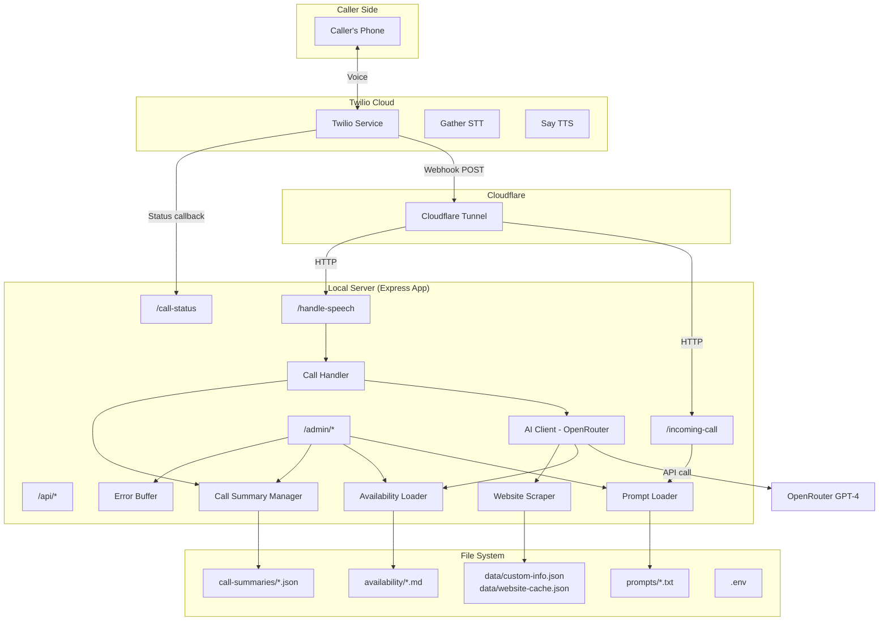

# Design Document: AI Phone Receptionist — Friends & Family Release

## Overview

This release extends the working AI Phone Receptionist demo into a system an office manager can operate day-to-day without developer intervention. The existing codebase already handles inbound calls via Twilio Gather, processes speech through OpenRouter (GPT-4), generates call summaries, and serves a web chat interface.

The main additions are:
1. An admin web UI (`/admin`) for prompt editing, call log browsing, provider availability management, and system status
2. Provider availability via markdown files in an `availability/` directory, injected into AI context
3. An in-memory error buffer so the admin dashboard can show recent errors
4. Deployment support (startup script, systemd documentation)

The existing call flow (Gather-based STT → OpenRouter → TwiML `<Say>`) is unchanged. The admin UI is server-rendered HTML served by the same Express app — no frontend framework, no build step, no additional processes.

**Future upgrade path:** WebSocket streaming via Twilio Media Streams would provide lower latency and support for interruption/barge-in. The current Gather approach is the right choice for this release due to simplicity and reliability, but the WebSocket endpoint (`/media-stream`) already exists in the codebase for future use.

**Key Design Principles:**
- Extend, don't rewrite — build on the working demo
- No additional server processes — everything runs in one Express app
- No frontend build tools — admin UI is plain HTML/CSS/JS served as static files or inline
- Cross-platform — code runs on Windows (dev) and Linux (deployment)
- Office-manager friendly — no terminal access needed for day-to-day operations

## Architecture

### System Components



### Request Flow

**Inbound Call (unchanged from demo):**
1. Caller dials Twilio number
2. Twilio POSTs to `/incoming-call` via Cloudflare Tunnel
3. Server returns TwiML: `<Say>` greeting + `<Gather>` to listen
4. Caller speaks → Twilio STT → POST to `/handle-speech` with `SpeechResult`
5. Server sends text to OpenRouter with conversation context (system prompt + website data + availability data + history)
6. OpenRouter returns response → Server returns TwiML: `<Say>` response + `<Gather>` to continue
7. Loop steps 4-6 until call ends
8. Twilio POSTs to `/call-status` → Server generates call summary

**Admin UI:**
1. Office manager navigates to `/admin` in browser
2. Express serves HTML page with dashboard, navigation to sub-pages
3. Sub-pages (`/admin/prompts`, `/admin/calls`, `/admin/availability`, `/admin/status`) use fetch() to call API endpoints
4. API endpoints read/write files and return JSON

## Components and Interfaces

### New Module: `src/availability-loader.js`

Loads and manages provider availability markdown files.

```javascript
// availability-loader.js
class AvailabilityLoader {
  constructor(availabilityDir) // path to availability/ directory
  
  loadAll()              // Read all .md files from directory, store in memory
  getAll()               // Returns { filename: content } map
  getAIContext()          // Returns combined markdown content as a single string for AI
  getFile(filename)       // Returns content of a specific file
  saveFile(filename, content) // Write content to file on disk, update memory
  reload()               // Re-read all files from disk
  ensureDirectory()       // Create availability/ dir if it doesn't exist
}
```

### New Module: `src/error-buffer.js`

In-memory ring buffer for recent errors, displayed on admin dashboard.

```javascript
// error-buffer.js
class ErrorBuffer {
  constructor(maxSize = 50)
  
  add(error)             // Add error object { message, timestamp, context }
  getAll()               // Returns array of recent errors, newest first
  clear()                // Clear all stored errors
  count()                // Returns number of stored errors
}
```

### New: Admin Routes (added to `src/server.js`)

```javascript
// Admin pages (serve HTML)
GET  /admin                  // Dashboard page
GET  /admin/prompts          // Prompt editor page
GET  /admin/calls            // Call logs page
GET  /admin/availability     // Availability editor page

// Admin API endpoints (JSON)
GET  /admin/api/status       // { uptime, activeCalls, model, phone, recentErrors }
GET  /admin/api/prompts      // { prompts: [{ name, filename, content }] }
PUT  /admin/api/prompts/:filename  // { content } → save and reload
GET  /admin/api/calls        // { calls: [...] } with pagination (?page=1&limit=20)
GET  /admin/api/calls/:id    // Single call log detail
GET  /admin/api/availability // { files: [{ filename, content }] }
PUT  /admin/api/availability/:filename // { content } → save and reload
POST /admin/api/reload       // Reload prompts + availability
POST /admin/api/refresh-website // Re-scrape website data
```

### Modified Module: `src/ai-client.js`

Add availability context alongside existing website context.

```javascript
// New method
setAvailabilityContext(context)  // Store availability text for inclusion in system prompt

// Modified: initSession() 
// Now appends availability context after website context in the system prompt
```

### Modified Module: `src/prompts.js`

Add methods to support admin editing.

```javascript
// New methods
getAll()                        // Returns { name, filename, content } for each prompt
savePrompt(filename, content)   // Write to disk and reload
```

### Modified Module: `src/call-summary.js`

Add pagination support for call log listing.

```javascript
// New method
getSummariesPaginated(page, limit)  // Returns { calls, total, page, totalPages }
getSummaryById(callId)              // Returns single call summary by filename/id
```

### Admin UI Pages

All admin pages are plain HTML files served from `public/admin/`. They use vanilla JavaScript with `fetch()` to call the admin API endpoints. No framework, no build step.

```
public/
  admin/
    index.html          // Dashboard
    prompts.html        // Prompt editor
    calls.html          // Call log browser
    availability.html   // Availability editor
    admin.css           // Shared styles
    admin.js            // Shared JS utilities (fetch wrapper, nav, etc.)
```

**Dashboard (`index.html`):**
- Server uptime, active call count
- OpenRouter model name, Twilio phone number
- Recent errors list (from error buffer)
- Quick-action buttons: reload prompts, refresh website data
- Navigation links to other admin pages

**Prompt Editor (`prompts.html`):**
- List of all prompt files with text areas
- Save button per prompt
- Validation: reject empty content
- Success/error feedback messages

**Call Logs (`calls.html`):**
- Table of calls: date, caller phone, duration, summary snippet
- Click to expand full transcript
- Pagination (20 per page)

**Availability Editor (`availability.html`):**
- List of provider markdown files with text areas
- Save button per file
- Option to create new availability file
- Reload button

## Data Models

### Error Entry

```javascript
{
  message: String,      // Error message
  timestamp: String,    // ISO 8601 timestamp
  context: String,      // Where the error occurred (e.g., "openrouter-api", "file-write")
  stack: String         // Stack trace (optional, for debugging)
}
```

### Admin Status Response

```javascript
{
  uptime: Number,           // Server uptime in seconds
  activeCalls: Number,      // Current active call count
  model: String,            // OpenRouter model name
  phoneNumber: String,      // Twilio phone number
  recentErrors: Array,      // Last N errors from buffer
  promptCount: Number,      // Number of loaded prompts
  availabilityCount: Number // Number of availability files
}
```

### Prompt List Response

```javascript
{
  prompts: [
    {
      name: String,       // Display name (e.g., "System Prompt")
      filename: String,   // File name (e.g., "system-prompt.txt")
      content: String     // Current file content
    }
  ]
}
```

### Call Log List Response

```javascript
{
  calls: [
    {
      id: String,           // Filename-based ID
      callSid: String,      // Twilio call SID
      callerPhone: String,  // Caller's phone number
      startTime: String,    // ISO 8601
      duration: String,     // Human-readable duration
      summary: String       // AI-generated summary
    }
  ],
  total: Number,
  page: Number,
  totalPages: Number
}
```

### Availability File Response

```javascript
{
  files: [
    {
      filename: String,   // e.g., "dr-smith.md"
      content: String     // Markdown content
    }
  ]
}
```

### Existing Models (unchanged)

The following existing data structures remain as-is:
- **Conversation history** — `Map<sessionId, Message[]>` in `ai-client.js`
- **Call session data** — `Map<callSid, { callSid, from, to, startTime, audioBuffer }>` in `call-handler.js`
- **Call summary JSON** — `{ callSid, callerPhone, twilioNumber, startTime, endTime, duration, summary, fullTranscript }` in `call-summaries/`
- **Website cache** — `{ lastUpdated, practiceInfo, clinicians, services, insurance, rawContent }` in `data/website-cache.json`
- **Custom info** — `{ address, hours, parking, additionalInfo }` in `data/custom-info.json`
- **Config** — `{ twilio: {...}, openRouter: {...}, server: {...} }` from `src/config.js`


## Correctness Properties

*A property is a characteristic or behavior that should hold true across all valid executions of a system — essentially, a formal statement about what the system should do. Properties serve as the bridge between human-readable specifications and machine-verifiable correctness guarantees.*

### Property 1: Status endpoint completeness

*For any* system state (any uptime value, any number of active calls, any configured model and phone number), the `/admin/api/status` endpoint SHALL return a response containing all required fields: uptime, activeCalls, model, phoneNumber, and recentErrors.

**Validates: Requirements 1.1, 5.1**

### Property 2: Error buffer stores errors with metadata

*For any* error occurrence in the system (API failure, file I/O failure, or any other caught exception), the error buffer SHALL contain an entry with a non-empty message, a valid ISO 8601 timestamp, and a non-empty context string.

**Validates: Requirements 1.2, 8.1, 8.2**

### Property 3: Error buffer ring behavior

*For any* sequence of N errors added to the error buffer where N > 50, the buffer SHALL contain exactly 50 entries, and those 50 entries SHALL be the most recently added errors in newest-first order.

**Validates: Requirements 8.3**

### Property 4: Prompt listing returns all files

*For any* set of prompt text files in the `prompts/` directory, the prompts API endpoint SHALL return an entry for each file containing its filename and current content.

**Validates: Requirements 2.1**

### Property 5: Prompt save/read round-trip

*For any* valid (non-empty, non-whitespace-only) prompt content string, saving it via the prompt save API and then reading it back via the prompt listing API SHALL return identical content.

**Validates: Requirements 2.2, 2.4**

### Property 6: Empty/whitespace prompt rejection

*For any* string composed entirely of whitespace characters (including the empty string), attempting to save it as a prompt SHALL be rejected with an error response, and the original prompt content SHALL remain unchanged.

**Validates: Requirements 2.3**

### Property 7: Availability loading returns all files

*For any* set of markdown files in the `availability/` directory, the availability loader SHALL return a map containing every file's name and its complete content.

**Validates: Requirements 3.1, 3.3**

### Property 8: Availability content included in AI context

*For any* set of availability markdown files with arbitrary content, when an AI session is initialized, the system prompt context string SHALL contain the content of every availability file.

**Validates: Requirements 3.2, 6.1**

### Property 9: Availability save/read round-trip

*For any* non-empty availability content string, saving it via the availability save API and then reading it back SHALL return identical content.

**Validates: Requirements 3.4**

### Property 10: Reload updates in-memory data from disk

*For any* modification to prompt files or availability files on disk, calling the reload endpoint SHALL cause subsequent API reads to return the updated content.

**Validates: Requirements 5.2**

### Property 11: Call logs sorted by most recent first

*For any* set of call log files with distinct timestamps, the call logs API SHALL return them sorted by start time in descending order (most recent first).

**Validates: Requirements 4.1**

### Property 12: Call log detail contains required fields

*For any* call log entry, the detail response SHALL contain non-null values for: callerPhone, duration, summary, and fullTranscript.

**Validates: Requirements 4.2**

### Property 13: Call log pagination correctness

*For any* total number of call logs N and any valid page number P (with page size 20), the paginated response SHALL return at most 20 entries, the correct total count N, and the correct total page count ceil(N/20).

**Validates: Requirements 4.3**

### Property 14: AI context includes website and custom info

*For any* website data and custom practice information, when an AI session is initialized, the system prompt context string SHALL contain the practice name, location, and any custom info fields that are present.

**Validates: Requirements 6.2**

### Property 15: TwiML greeting contains prompt content

*For any* greeting prompt text, the TwiML response from `/incoming-call` SHALL contain that text (XML-escaped) within a `<Say>` element and SHALL include a `<Gather>` element for speech input.

**Validates: Requirements 7.1**

### Property 16: Speech text forwarded to AI client

*For any* non-empty speech result text posted to `/handle-speech`, the system SHALL pass that text to the AI client's `sendMessage` method with the correct call session ID.

**Validates: Requirements 7.2**

### Property 17: AI response wrapped in TwiML Say and Gather

*For any* AI response text, the TwiML returned by `/handle-speech` SHALL contain a `<Say>` element with the response text (XML-escaped) and a `<Gather>` element to continue listening.

**Validates: Requirements 7.3**

### Property 18: Call end triggers summary generation

*For any* completed call with at least one conversation turn, ending the call SHALL produce a call log JSON file in the `call-summaries/` directory containing the call SID, caller phone, and transcript.

**Validates: Requirements 7.6**

## Error Handling

### Error Categories

**1. External Service Errors**
- OpenRouter API failures → Log to error buffer, return error TwiML to caller, continue serving other requests
- Website scrape failures → Use cached data from `data/website-cache.json`, log warning to error buffer
- Twilio webhook failures → Log error, Twilio handles retry/fallback on its end

**2. File I/O Errors**
- Prompt file read/write failures → Log to error buffer, return error response to admin UI, keep existing in-memory data
- Availability file read/write failures → Same pattern as prompts
- Call summary write failures → Log error, don't crash the call flow
- Missing `availability/` directory → Create it automatically on startup

**3. Validation Errors**
- Empty prompt content → Reject with 400 status and error message
- Invalid filename in API request → Reject with 400 status
- Missing environment variables → Exit on startup with clear message (existing behavior)

### Error Recovery Strategy

All errors are caught and logged to the in-memory error buffer (max 50 entries). The system never crashes on a caught error — it logs, responds with an appropriate error message, and continues operating. The admin dashboard shows recent errors so the office manager can report issues.

For call-flow errors specifically, the system returns the error prompt TwiML and hangs up gracefully rather than leaving the caller in silence.

### Error Buffer Integration

The `ErrorBuffer` class is instantiated once at server startup. All `catch` blocks throughout the codebase call `errorBuffer.add()` with a descriptive message and context string. The admin status API reads from this buffer.

## Testing Strategy

### Dual Testing Approach

**Unit tests** focus on:
- Specific examples: admin page returns correct HTML, specific TwiML structure for known inputs
- Edge cases: empty availability directory, missing prompt files, call log with no conversation turns
- Error conditions: OpenRouter timeout, file permission denied, malformed JSON in call logs
- Integration points: Express route handling, file system operations

**Property-based tests** focus on:
- Universal properties that hold for all inputs (e.g., round-trip consistency for prompt saves)
- Comprehensive input coverage through randomization (e.g., any prompt content survives save/load)
- Invariants that must be preserved (e.g., error buffer never exceeds 50 entries)

Together, unit tests catch concrete bugs while property tests verify general correctness across the input space.

### Property-Based Testing Configuration

**Library:** `fast-check` (to be added as dev dependency)
**Test Runner:** `vitest` (to be added as dev dependency)
**Minimum iterations:** 100 per property test

**Test Tagging Format:**
```javascript
// Feature: ai-phone-receptionist, Property 5: Prompt save/read round-trip
test('prompt save then read returns identical content', async () => {
  await fc.assert(
    fc.asyncProperty(
      fc.string({ minLength: 1 }).filter(s => s.trim().length > 0),
      async (content) => {
        // Save prompt, read back, verify identical
      }
    ),
    { numRuns: 100 }
  )
})
```

Each correctness property (1-18) SHALL be implemented as a single property-based test. Tests generate random inputs using fast-check generators and verify the property holds for all generated inputs.

### Unit Testing Focus Areas

- Admin HTML pages serve correctly and contain expected elements
- TwiML responses are well-formed XML
- Error prompt fallback when AI fails
- No-speech-detected handling
- Pagination edge cases (0 items, exactly 20 items, 21 items)
- Availability directory auto-creation
- Config validation on startup

### Test Organization

```
tests/
  unit/
    error-buffer.test.js
    availability-loader.test.js
    prompts.test.js
    call-summary.test.js
    admin-routes.test.js
    twiml.test.js
  property/
    error-buffer.property.test.js
    prompts.property.test.js
    availability.property.test.js
    call-logs.property.test.js
    ai-context.property.test.js
    twiml.property.test.js
```
