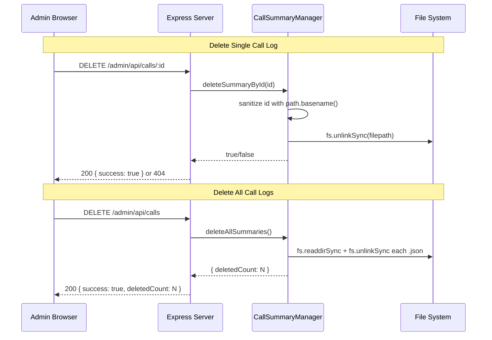

# Design Document: Call Log Deletion

## Overview

This feature adds delete capabilities to the call logs page in the admin panel. Administrators can delete a single call log or all call logs at once. Call summaries are JSON files stored in `call-summaries/`. The implementation adds two new methods to `CallSummaryManager` (`deleteSummaryById`, `deleteAllSummaries`), two new Express DELETE endpoints, and UI controls (per-row delete button, "Delete All" button with confirmation dialogs) on the existing `calls.html` page.

### Key Design Decisions

1. **DELETE HTTP methods** — Uses `DELETE /admin/api/calls/:id` and `DELETE /admin/api/calls` to follow REST conventions. Both routes sit behind the existing IP whitelist and auth middleware, so no new auth logic is needed.
2. **Path traversal prevention** — All ID parameters are sanitized with `path.basename()` in both the server route handler and the `CallSummaryManager` methods, providing defense in depth.
3. **Confirmation dialogs** — Browser `confirm()` dialogs are used for both single and bulk delete. Simple, accessible, and consistent with the vanilla JS approach of the admin panel.
4. **No new dependencies** — Uses only `fs.unlinkSync` and `fs.readdirSync` from Node.js `fs` module, already imported in `call-summary.js`.
5. **Optimistic UI removal** — On single delete, the table row is removed from the DOM immediately after a successful API response, avoiding a full page reload. On delete-all, the call list is reloaded to reflect the empty state.

## Architecture



## Components and Interfaces

### 1. `src/call-summary.js` — New Deletion Methods

Add two methods to the existing `CallSummaryManager` class:

```js
/**
 * Delete a single call summary by ID
 * @param {string} id - Call summary ID (filename without .json)
 * @returns {boolean} true if deleted, false if not found
 */
deleteSummaryById(id) {
  const sanitizedId = path.basename(id);
  const filename = sanitizedId.endsWith('.json') ? sanitizedId : `${sanitizedId}.json`;
  const filepath = path.join(this.summariesDir, filename);

  if (!fs.existsSync(filepath)) {
    return false;
  }

  fs.unlinkSync(filepath);
  return true;
}

/**
 * Delete all call summary JSON files
 * @returns {number} count of deleted files
 */
deleteAllSummaries() {
  const files = fs.readdirSync(this.summariesDir)
    .filter(file => file.endsWith('.json'));

  for (const file of files) {
    fs.unlinkSync(path.join(this.summariesDir, file));
  }

  return files.length;
}
```

### 2. `src/server.js` — New API Endpoints

Two new routes registered in the admin API section, protected by the existing auth and IP whitelist middleware:

```js
// DELETE /admin/api/calls/:id — Delete a single call log
app.delete('/admin/api/calls/:id', (req, res) => { ... });

// DELETE /admin/api/calls — Delete all call logs
app.delete('/admin/api/calls', (req, res) => { ... });
```

The single-delete handler sanitizes `req.params.id` with `path.basename()` before passing to `deleteSummaryById`. Returns 200 on success, 404 if not found, 500 on unexpected error.

The delete-all handler calls `deleteAllSummaries()` and returns the count. Returns 200 with `{ deletedCount }` on success (including 0), 500 on error.

### 3. `public/admin/calls.html` — UI Changes

- Add a **"Delete All"** button (`.btn-danger`) in the card header next to the "Call History" heading.
- Add a **delete button** (🗑️ icon or text) in each table row's Actions column.
- Both buttons trigger `confirm()` dialogs before sending requests.
- Single delete: calls `DELETE /admin/api/calls/:id`, removes the row from DOM, shows success toast.
- Delete all: calls `DELETE /admin/api/calls`, shows success toast with count, reloads the call list.
- The "Delete All" button is disabled while the request is in flight to prevent duplicate submissions.

## Data Models

### API Request/Response

**DELETE /admin/api/calls/:id**

| Field | Value |
|-------|-------|
| Method | `DELETE` |
| URL | `/admin/api/calls/:id` |
| Auth | Existing admin session cookie |
| Success Response | `200 { success: true, message: "Call log deleted" }` |
| Not Found | `404 { error: "Call log not found" }` |
| Error | `500 { error: "Failed to delete call log", details: "..." }` |

**DELETE /admin/api/calls**

| Field | Value |
|-------|-------|
| Method | `DELETE` |
| URL | `/admin/api/calls` |
| Auth | Existing admin session cookie |
| Success Response | `200 { success: true, deletedCount: N }` |
| Error | `500 { error: "Failed to delete call logs", details: "..." }` |

### Existing Call Summary JSON Structure (unchanged)

```json
{
  "callSid": "CA9a4c2121...",
  "callerPhone": "+1234567890",
  "twilioNumber": "+0987654321",
  "startTime": "2026-02-14T22:18:42.308Z",
  "endTime": "2026-02-14T22:20:15.366Z",
  "duration": "93 seconds",
  "summary": "...",
  "fullTranscript": [
    { "speaker": "AI Receptionist", "message": "..." },
    { "speaker": "Caller", "message": "..." }
  ]
}
```


## Correctness Properties

*A property is a characteristic or behavior that should hold true across all valid executions of a system — essentially, a formal statement about what the system should do. Properties serve as the bridge between human-readable specifications and machine-verifiable correctness guarantees.*

### Property 1: Delete single existing call log

*For any* call summary JSON file that exists in the `call-summaries/` directory, calling `deleteSummaryById` with its ID should delete the file from disk and return `true`. After deletion, the file should no longer exist.

**Validates: Requirements 1.3, 3.1, 3.4**

### Property 2: Delete non-existent call log returns false

*For any* string ID that does not correspond to an existing JSON file in the `call-summaries/` directory, calling `deleteSummaryById` should return `false` and leave the directory contents unchanged.

**Validates: Requirements 1.5, 3.3**

### Property 3: Path traversal sanitization

*For any* string input containing path separators or directory traversal sequences (e.g., `../`, `/etc/passwd`), `deleteSummaryById` should resolve the file path to within the `call-summaries/` directory only. The sanitized path should never reference a file outside that directory.

**Validates: Requirements 1.7, 3.5**

### Property 4: Delete all removes all JSON files and returns correct count

*For any* set of N JSON files in the `call-summaries/` directory, calling `deleteAllSummaries` should delete all N files and return N. After the operation, zero JSON files should remain in the directory.

**Validates: Requirements 2.3, 3.2**

### Property 5: Delete all preserves non-JSON files

*For any* `call-summaries/` directory containing a mix of `.json` and non-`.json` files, calling `deleteAllSummaries` should only remove files with the `.json` extension. All non-JSON files should remain untouched.

**Validates: Requirements 2.7**

## Error Handling

| Scenario | Behavior |
|----------|----------|
| Delete single — file not found | `deleteSummaryById` returns `false`; API returns 404 `{ error: "Call log not found" }` |
| Delete single — fs error (permissions, etc.) | `deleteSummaryById` throws; API catches and returns 500 `{ error: "Failed to delete call log", details: "..." }` |
| Delete all — empty directory | `deleteAllSummaries` returns `0`; API returns 200 `{ success: true, deletedCount: 0 }` |
| Delete all — partial failure (some files fail to delete) | Exception thrown mid-loop; API catches and returns 500. Some files may already be deleted. |
| Path traversal attempt in ID | `path.basename()` strips directory components; resolved path stays within `call-summaries/`. If sanitized filename doesn't exist, returns 404. |
| Unauthenticated request | Existing auth middleware returns 401 (API) or redirects to login (page). Delete handlers never reached. |
| Malformed ID (empty string, special chars) | `path.basename()` handles gracefully; if resulting filename doesn't match a file, returns false/404. |

## Testing Strategy

### Unit Tests (vitest)

Unit tests cover specific examples, edge cases, and integration points:

- Delete button is present in each call log row HTML
- "Delete All" button is present in the card header
- `DELETE /admin/api/calls/:id` returns 404 for non-existent ID
- `DELETE /admin/api/calls/:id` returns 200 for existing ID
- `DELETE /admin/api/calls` returns 200 with `deletedCount: 0` for empty directory
- `DELETE /admin/api/calls` requires authentication (returns 401 without session)
- `DELETE /admin/api/calls/:id` requires authentication (returns 401 without session)

Test file: `tests/unit/call-log-deletion.test.js`

### Property-Based Tests (vitest + fast-check)

Each correctness property maps to a single property-based test. Tests use `fast-check` for input generation with a minimum of 100 iterations.

| Test File | Property | Tag |
|-----------|----------|-----|
| `tests/property/call-log-deletion.property.test.js` | Property 1 | Feature: call-log-deletion, Property 1: Delete single existing call log |
| `tests/property/call-log-deletion.property.test.js` | Property 2 | Feature: call-log-deletion, Property 2: Delete non-existent call log returns false |
| `tests/property/call-log-deletion.property.test.js` | Property 3 | Feature: call-log-deletion, Property 3: Path traversal sanitization |
| `tests/property/call-log-deletion.property.test.js` | Property 4 | Feature: call-log-deletion, Property 4: Delete all removes all JSON files and returns correct count |
| `tests/property/call-log-deletion.property.test.js` | Property 5 | Feature: call-log-deletion, Property 5: Delete all preserves non-JSON files |

**PBT Library:** `fast-check` (already installed)

**Test Runner:** `vitest --run`

**Generators needed:**
- `fc.string()` / `fc.stringMatching(...)` — for call log IDs, filenames
- `fc.nat()` — for generating N files to populate a temp directory
- `fc.array(fc.string())` — for generating sets of filenames
- `fc.constantFrom('.json', '.txt', '.log', '.md')` — for file extension mixing

Each property test must be tagged with a comment in the format:
```
// Feature: call-log-deletion, Property N: <property title>
```

Each property test must run a minimum of 100 iterations (`{ numRuns: 100 }`).
