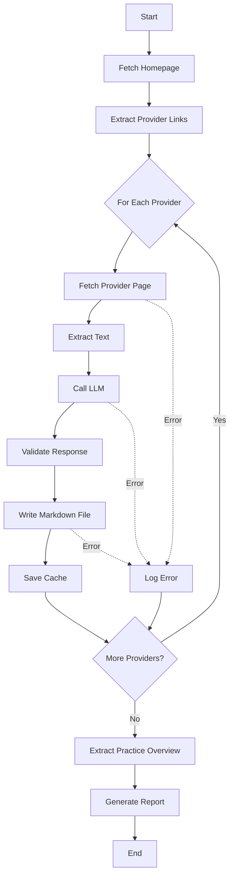

# Design Document: Multi-Page Provider Scraping

## Overview

This design transforms the provider scraping system from a single-page extraction model to a multi-page architecture. Instead of scraping only the homepage and sending all content to the LLM in one call, the system will:

1. Scrape the homepage to discover provider links
2. Visit each provider's individual page
3. Process each provider page separately with dedicated LLM calls
4. Generate individual markdown files incrementally
5. Cache each provider's content separately for debugging

This architecture enables extraction of detailed information (especially insurance details) that exists only on individual provider pages, while maintaining resilience through per-provider error handling.

## Architecture

### Current Architecture (Single-Page)

```
Homepage → Extract Text → Single LLM Call → Parse All Providers → Write All Files
```

**Limitations:**
- Misses information on individual provider pages
- Single point of failure (one LLM call for all providers)
- No incremental progress (all-or-nothing)
- Single cache file for entire scrape

### New Architecture (Multi-Page)

```
Homepage → Discover Provider Links
    ↓
For Each Provider:
    Fetch Provider Page → Extract Text → LLM Call → Validate → Write File → Cache
    ↓
Practice Overview: Homepage → Extract Text → LLM Call → Write File
    ↓
Generate Report
```

**Benefits:**
- Captures complete provider information from dedicated pages
- Resilient to individual provider failures
- Incremental progress (partial results preserved)
- Per-provider caching for debugging
- Parallel processing potential (future enhancement)

### Data Flow



## Components and Interfaces

### 1. Provider Link Extractor

**Purpose:** Discover all provider page URLs from the homepage

**Function Signature:**
```javascript
/**
 * Extract provider links from homepage HTML
 * @param {string} html - Homepage HTML content
 * @returns {Array<{name: string, url: string}>} Array of provider link objects
 */
function extractProviderLinks(html)
```

**Implementation Details:**
- Use Cheerio to parse HTML
- Look for links in "Meet the Team" section or navigation menu
- Common patterns: `/[name]`, `/providers/[name]`, `/team/[name]`
- Filter out non-provider links (about, contact, services, etc.)
- Validate URLs are well-formed
- Return array of objects with provider name (from link text) and URL

**Error Handling:**
- If no links found, log warning and return empty array
- If HTML parsing fails, throw error (fatal - cannot proceed)

### 2. Single Provider Processor

**Purpose:** Process one provider page from fetch to file write

**Function Signature:**
```javascript
/**
 * Process a single provider page
 * @param {object} providerLink - Provider link object {name, url}
 * @param {Browser} browser - Puppeteer browser instance (optional)
 * @param {number} index - Provider index for progress tracking
 * @param {number} total - Total number of providers
 * @returns {Promise<object>} Result object with status, slug, warnings, errors
 */
async function processSingleProvider(providerLink, browser, index, total)
```

**Implementation Details:**
1. Log progress: "Processing provider X of Y: [name]"
2. Start timer for duration tracking
3. Fetch provider page using `fetchWebsite(url, browser, providerName)`
4. Extract text using `extractText(html)`
5. Save cache using `saveScrapeCache(html, text, url)` with provider-specific filename
6. Call LLM with single-provider prompt
7. Validate response structure
8. Normalize provider name to slug
9. Validate provider data using `validateProvider()`
10. Write file using existing file write logic
11. Log duration
12. Return result object

**Result Object:**
```javascript
{
  success: boolean,
  providerName: string,
  slug: string,
  operation: 'created' | 'updated' | 'skipped',
  warnings: Array<string>,
  error: {type: string, message: string, url: string} | null,
  duration: number
}
```

**Error Handling:**
- Catch all errors at function level
- Log error with provider name and details
- Return result object with error field populated
- Never throw (allows processing to continue)

### 3. LLM Prompt Generator

**Purpose:** Generate appropriate prompts for single-provider vs practice overview extraction

**Function Signatures:**
```javascript
/**
 * Generate prompt for single provider extraction
 * @param {string} providerName - Provider name from link
 * @param {string} text - Extracted text from provider page
 * @returns {string} Formatted prompt for LLM
 */
function generateProviderPrompt(providerName, text)

/**
 * Generate prompt for practice overview extraction
 * @param {string} text - Extracted text from homepage
 * @returns {string} Formatted prompt for LLM
 */
function generatePracticeOverviewPrompt(text)
```

**Provider Prompt Template:**
```
Extract information for the provider named "[providerName]" from their profile page.

Focus on:
- Full name and credentials
- Professional bio and specialties
- Contact information (email, phone)
- Insurance providers accepted (CRITICAL - look for insurance, accepted plans, payment options)
- Education and training
- Therapeutic approaches

Return a JSON object with this structure:
{
  "name": "Full Name with Credentials",
  "content": "Complete markdown content for provider file",
  "email": "email@example.com or null",
  "phone": "phone number or null",
  "insurance": ["Insurance Provider 1", "Insurance Provider 2"] or []
}

Website content:
[text]
```

**Practice Overview Prompt Template:**
```
Extract general practice information from the homepage.

Focus on:
- Practice name and mission
- Services offered
- Location and contact information
- General policies

Return a JSON object with this structure:
{
  "practiceOverview": "Complete markdown content for practice overview"
}

Website content:
[text]
```

### 4. Modified Main Function

**Purpose:** Orchestrate the multi-page scraping process

**Implementation Flow:**
```javascript
async function main() {
  // 1. Initialize
  const startTime = Date.now();
  let browser = null;
  const results = {
    providers: [],
    operations: {
      created: [],
      updated: [],
      validationWarnings: [],
      errors: [],
      timing: {}
    }
  };

  try {
    // 2. Launch browser if Puppeteer mode
    if (SCRAPING_MODE === 'puppeteer') {
      browser = await browserManager.launchBrowser({headless: BROWSER_HEADLESS});
    }

    // 3. Fetch homepage
    const homepageHtml = await fetchWebsite(WEBSITE_URL, browser, 'Homepage');
    
    // 4. Extract provider links
    const providerLinks = extractProviderLinks(homepageHtml);
    console.log(`Found ${providerLinks.length} provider links`);

    // 5. Process each provider
    for (let i = 0; i < providerLinks.length; i++) {
      const result = await processSingleProvider(
        providerLinks[i], 
        browser, 
        i + 1, 
        providerLinks.length
      );
      results.providers.push(result);
      
      // Track operations
      if (result.success) {
        if (result.operation === 'created') {
          results.operations.created.push(result.slug);
        } else if (result.operation === 'updated') {
          results.operations.updated.push(result.slug);
        }
        
        if (result.warnings.length > 0) {
          results.operations.validationWarnings.push({
            provider: result.providerName,
            slug: result.slug,
            warnings: result.warnings
          });
        }
      }
      
      if (result.error) {
        results.operations.errors.push({
          provider: result.providerName,
          type: result.error.type,
          message: result.error.message,
          url: result.error.url,
          duration: result.duration
        });
      }
    }

    // 6. Extract practice overview from homepage
    const practiceOverview = await extractPracticeOverview(
      homepageHtml, 
      extractText(homepageHtml)
    );
    
    // 7. Write practice overview file
    if (practiceOverview) {
      writePracticeOverview(practiceOverview);
    }

    // 8. Generate report
    results.operations.timing.total = Date.now() - startTime;
    const reportContent = generateScrapingReport(results);
    writeReport(reportContent);

    // 9. Display summary
    console.log(`\n✨ Multi-page scraping complete!`);
    console.log(`📈 Processed: ${providerLinks.length} providers`);
    console.log(`✅ Successful: ${results.providers.filter(r => r.success).length}`);
    console.log(`❌ Failed: ${results.providers.filter(r => !r.success).length}`);

    process.exit(0);
  } finally {
    if (browser) {
      await browserManager.closeBrowser(browser);
    }
  }
}
```

## Data Models

### Provider Link Object
```javascript
{
  name: string,      // Provider name from link text (e.g., "Jeff")
  url: string        // Full URL to provider page
}
```

### Provider Result Object
```javascript
{
  success: boolean,           // Overall success status
  providerName: string,       // Provider name
  slug: string,              // Normalized slug for filename
  operation: string,         // 'created' | 'updated' | 'skipped'
  warnings: Array<string>,   // Validation warnings
  error: {                   // Error details if failed
    type: string,            // 'timeout' | 'navigation' | 'parsing' | 'llm' | 'unknown'
    message: string,
    url: string
  } | null,
  duration: number           // Processing time in ms
}
```

### LLM Response (Single Provider)
```javascript
{
  name: string,              // Full name with credentials
  content: string,           // Markdown content for file
  email: string | null,      // Email address
  phone: string | null,      // Phone number
  insurance: Array<string>   // Insurance providers
}
```

### LLM Response (Practice Overview)
```javascript
{
  practiceOverview: string   // Markdown content for practice overview
}
```

## Correctness Properties

*A property is a characteristic or behavior that should hold true across all valid executions of a system—essentially, a formal statement about what the system should do. Properties serve as the bridge between human-readable specifications and machine-verifiable correctness guarantees.*


### Property 1: Provider Link Extraction Completeness
*For any* HTML document containing provider links in the "Meet the Team" section, the extraction function should return all valid provider links with correct name and URL pairs.
**Validates: Requirements 1.1, 1.4**

### Property 2: URL Validation Correctness
*For any* URL string, the validation function should correctly identify whether it points to a valid provider page based on URL structure and format.
**Validates: Requirements 1.2**

### Property 3: Error Resilience
*For any* list of providers where some fail at any stage (fetch, LLM, validation, file write, cache), the scraper should continue processing all remaining providers and log all failures.
**Validates: Requirements 1.3, 2.3, 3.4, 5.3, 6.2, 6.3, 9.4**

### Property 4: HTML Fetch Completeness
*For any* valid provider link, the fetch operation should return complete HTML content or fail with a properly typed error after all retries.
**Validates: Requirements 2.1**

### Property 5: Configuration Consistency
*For any* scraping run, all fetch operations (homepage and provider pages) should use the same scraping mode configuration.
**Validates: Requirements 2.5**

### Property 6: LLM Call Isolation
*For any* provider, the LLM should receive exactly one API call containing only that provider's page content, not mixed with other providers.
**Validates: Requirements 3.1**

### Property 7: Single-Provider Prompt Structure
*For any* provider LLM call, the prompt should contain the provider's name and instructions for extracting a single provider's information.
**Validates: Requirements 3.2**

### Property 8: Response Validation Completeness
*For any* LLM response, the validation should correctly identify whether all required fields (name, content) are present and properly formatted.
**Validates: Requirements 3.3**

### Property 9: Operation Tracking Accuracy
*For any* scraping run, the tracked counts of created, updated, successful, and failed operations should exactly match the actual operations performed.
**Validates: Requirements 3.5, 4.3, 6.4**

### Property 10: Validation Before Write
*For any* provider file write operation, validation should occur before the file is written to disk.
**Validates: Requirements 4.4**

### Property 11: Non-Blocking Validation
*For any* provider with validation warnings, the file should still be created and the warnings should be logged and included in the report.
**Validates: Requirements 4.5**

### Property 12: Cache File Structure
*For any* successfully fetched provider page, a cache file should be created containing the provider name in the filename, stored in data/scrape-cache/, and including provider name, URL, HTML, and extracted text.
**Validates: Requirements 5.1, 5.2, 5.4**

### Property 13: Error Logging Completeness
*For any* error that occurs during processing, the error log should contain provider name, error type, error message, URL, and retry attempts.
**Validates: Requirements 6.1**

### Property 14: Report Completeness
*For any* scraping run, the generated report should contain all required sections (summary, providers, insurance statistics, validation issues, errors grouped by type, recommendations) and include data for all processed providers.
**Validates: Requirements 7.3, 7.4, 7.5, 8.6**

### Property 15: Progress Logging Format
*For any* provider being processed, the log should contain "Processing provider X of Y: [name]" where X is the current index and Y is the total count.
**Validates: Requirements 7.1**

### Property 16: Duration Logging
*For any* successfully processed provider, the log should include the processing duration in milliseconds.
**Validates: Requirements 7.2**

### Property 17: Environment Variable Compatibility
*For any* existing environment variable (SCRAPING_MODE, PAGE_LOAD_TIMEOUT, BROWSER_HEADLESS, etc.), the multi-page scraper should respect its value and behave accordingly.
**Validates: Requirements 8.5**

### Property 18: Practice Overview Extraction
*For any* homepage, the scraper should extract practice overview information via a separate LLM call and save it to data/practice/practice-overview.md.
**Validates: Requirements 9.1, 9.2, 9.3**

## Error Handling

### Error Categories

1. **Fatal Errors** (stop execution):
   - Homepage fetch failure (cannot discover providers)
   - Browser launch failure (Puppeteer mode only)
   - Directory creation failure

2. **Non-Fatal Errors** (log and continue):
   - Individual provider page fetch failure
   - LLM call failure for a provider
   - File write failure for a provider
   - Cache save failure
   - Practice overview extraction failure

### Error Response Structure

All errors should include:
```javascript
{
  type: 'timeout' | 'navigation' | 'parsing' | 'llm' | 'validation' | 'filesystem' | 'unknown',
  message: string,
  provider: string,
  url: string,
  attempts: number,
  duration: number
}
```

### Retry Strategy

- Use existing retry logic from `fetchWithPuppeteer` (exponential backoff)
- MAX_RETRIES attempts per provider page
- No retries for LLM calls (fail fast, log, continue)
- No retries for file operations (fail fast, log, continue)

### Error Recovery

- Provider-level failures: Skip provider, log error, continue with next
- Cache failures: Log warning, continue (caching is non-critical)
- Practice overview failure: Log warning, continue with provider processing
- Homepage failure: Exit immediately (fatal)

## Testing Strategy

### Dual Testing Approach

This feature requires both unit tests and property-based tests for comprehensive coverage:

- **Unit tests**: Verify specific examples, edge cases, and error conditions
- **Property tests**: Verify universal properties across all inputs
- Both are complementary and necessary

### Unit Testing Focus

Unit tests should cover:
- Specific HTML structures for link extraction
- Known provider page formats
- Error scenarios (timeout, 404, malformed HTML)
- Cache file creation and structure
- Report generation with known data
- Integration between components

Avoid writing too many unit tests - property-based tests handle covering lots of inputs.

### Property-Based Testing

Use **fast-check** (JavaScript property-based testing library) for property tests.

**Configuration:**
- Minimum 100 iterations per property test
- Each test must reference its design document property
- Tag format: `// Feature: multi-page-provider-scraping, Property N: [property text]`

**Property Test Examples:**

```javascript
// Feature: multi-page-provider-scraping, Property 3: Error Resilience
test('provider failures do not stop processing', async () => {
  await fc.assert(
    fc.asyncProperty(
      fc.array(providerLinkArbitrary(), { minLength: 3, maxLength: 10 }),
      fc.integer({ min: 0, max: 2 }), // number of providers to fail
      async (providers, failCount) => {
        // Inject failures into random providers
        const failIndices = selectRandomIndices(providers.length, failCount);
        const results = await processProviders(providers, failIndices);
        
        // All providers should have results
        expect(results.length).toBe(providers.length);
        
        // Failed providers should have error field
        failIndices.forEach(i => {
          expect(results[i].error).toBeDefined();
        });
        
        // Successful providers should not have error field
        const successIndices = range(providers.length).filter(i => !failIndices.includes(i));
        successIndices.forEach(i => {
          expect(results[i].error).toBeNull();
          expect(results[i].success).toBe(true);
        });
      }
    ),
    { numRuns: 100 }
  );
});

// Feature: multi-page-provider-scraping, Property 9: Operation Tracking Accuracy
test('tracked operations match actual operations', async () => {
  await fc.assert(
    fc.asyncProperty(
      fc.array(providerDataArbitrary(), { minLength: 1, maxLength: 20 }),
      async (providers) => {
        const results = await processProviders(providers);
        const operations = aggregateOperations(results);
        
        // Count actual operations
        const actualCreated = results.filter(r => r.operation === 'created').length;
        const actualUpdated = results.filter(r => r.operation === 'updated').length;
        const actualSuccess = results.filter(r => r.success).length;
        const actualFailed = results.filter(r => !r.success).length;
        
        // Tracked counts should match actual
        expect(operations.created.length).toBe(actualCreated);
        expect(operations.updated.length).toBe(actualUpdated);
        expect(actualSuccess + actualFailed).toBe(providers.length);
      }
    ),
    { numRuns: 100 }
  );
});

// Feature: multi-page-provider-scraping, Property 12: Cache File Structure
test('cache files have correct structure and location', async () => {
  await fc.assert(
    fc.asyncProperty(
      providerLinkArbitrary(),
      htmlContentArbitrary(),
      async (providerLink, html) => {
        const cacheFile = await saveScrapeCache(
          html, 
          extractText(html), 
          providerLink.url,
          providerLink.name
        );
        
        // Cache file should exist
        expect(fs.existsSync(cacheFile)).toBe(true);
        
        // Should be in correct directory
        expect(cacheFile).toContain('data/scrape-cache/');
        
        // Filename should contain provider name
        expect(path.basename(cacheFile)).toContain(
          normalizeProviderName(providerLink.name)
        );
        
        // Content should have required fields
        const content = JSON.parse(fs.readFileSync(cacheFile, 'utf-8'));
        expect(content).toHaveProperty('provider');
        expect(content).toHaveProperty('url');
        expect(content).toHaveProperty('rawHtml');
        expect(content).toHaveProperty('extractedText');
        expect(content.provider).toBe(providerLink.name);
      }
    ),
    { numRuns: 100 }
  );
});
```

### Test Generators (Arbitraries)

```javascript
// Generate random provider links
function providerLinkArbitrary() {
  return fc.record({
    name: fc.string({ minLength: 3, maxLength: 30 }),
    url: fc.webUrl()
  });
}

// Generate random HTML content
function htmlContentArbitrary() {
  return fc.string({ minLength: 100, maxLength: 5000 });
}

// Generate random provider data
function providerDataArbitrary() {
  return fc.record({
    name: fc.string({ minLength: 5, maxLength: 50 }),
    content: fc.string({ minLength: 100, maxLength: 2000 }),
    email: fc.option(fc.emailAddress()),
    phone: fc.option(fc.string({ minLength: 10, maxLength: 15 })),
    insurance: fc.array(fc.string({ minLength: 3, maxLength: 30 }), { maxLength: 5 })
  });
}
```

### Integration Testing

Test the complete flow:
1. Mock homepage with provider links
2. Mock individual provider pages
3. Mock LLM responses
4. Verify files created
5. Verify cache files created
6. Verify report generated
7. Verify error handling

### Manual Testing Checklist

- [ ] Run against real RTC website
- [ ] Verify all provider pages discovered
- [ ] Verify insurance information extracted
- [ ] Verify cache files created for each provider
- [ ] Verify report includes all providers
- [ ] Test with network failures (disconnect during scraping)
- [ ] Test with invalid provider pages (404s)
- [ ] Verify existing environment variables still work
- [ ] Compare output with single-page scraper (insurance coverage should improve)

## Performance Considerations

### Current Performance

- Single-page: 1 homepage fetch + 1 LLM call
- Multi-page: 1 homepage fetch + N provider fetches + (N + 1) LLM calls

### Optimization Opportunities

1. **Parallel Processing** (future enhancement):
   - Process multiple providers concurrently
   - Limit concurrency to avoid rate limiting
   - Use Promise.all() with concurrency control

2. **Caching Strategy**:
   - Cache provider pages between runs
   - Only re-fetch if page changed (ETags, Last-Modified)
   - Configurable cache TTL

3. **Rate Limiting**:
   - Add delays between provider fetches
   - Respect robots.txt
   - Configurable delay via environment variable

4. **Browser Reuse**:
   - Already implemented: single browser instance for all fetches
   - Reduces overhead of launching multiple browsers

### Expected Performance

For 10 providers:
- Fetch time: ~10-30 seconds (depending on page load times)
- LLM processing: ~30-60 seconds (3-6 seconds per provider)
- Total: ~40-90 seconds

This is slower than single-page (~30-60 seconds) but provides significantly better data quality.

## Migration Strategy

### Backward Compatibility

The new multi-page scraper should:
- Maintain the same CLI interface (`node src/scrape-providers.js`)
- Use the same environment variables
- Generate the same file structure (data/providers/, data/practice/)
- Produce compatible markdown files
- Generate enhanced reports (backward compatible format)

### Rollout Plan

1. **Phase 1**: Implement multi-page scraper as new functions in existing file
2. **Phase 2**: Add feature flag (MULTI_PAGE_SCRAPING=true/false)
3. **Phase 3**: Test both modes side-by-side
4. **Phase 4**: Make multi-page the default
5. **Phase 5**: Remove single-page code after validation period

### Validation Criteria

Before making multi-page the default:
- [ ] All existing tests pass
- [ ] New property tests pass (100+ iterations each)
- [ ] Manual testing confirms improved insurance extraction
- [ ] Performance is acceptable (<2 minutes for 10 providers)
- [ ] Error handling works correctly (tested with network failures)
- [ ] Reports are comprehensive and accurate

## Future Enhancements

1. **Parallel Processing**: Process multiple providers concurrently
2. **Smart Caching**: Only re-fetch changed pages
3. **Incremental Updates**: Update only changed providers
4. **Provider Discovery Improvements**: Better link detection algorithms
5. **LLM Prompt Optimization**: Fine-tune prompts for better extraction
6. **Structured Data Extraction**: Use JSON-LD or schema.org markup if available
7. **Image Extraction**: Download and store provider photos
8. **Diff Reports**: Show what changed between scraping runs
