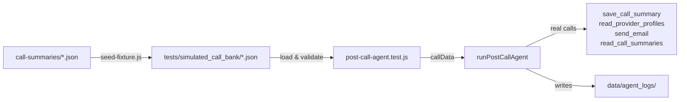

# Design Document: Post-Call Agent Testing

## Overview

A lean test harness that replays stored call fixtures through the real `runPostCallAgent` function. No mocking, no assertion framework beyond basic completion checks — the real agent tools (OpenRouter, provider profiles, email, etc.) run as-is. The only thing avoided is making actual phone calls.

The harness consists of three pieces:
1. **Call fixtures** — JSON files in `tests/simulated_call_bank/` matching the `callData` shape that `runPostCallAgent` accepts.
2. **A vitest test file** — loads fixtures, calls the real agent, and reports which tools were invoked.
3. **A seed utility** — converts existing call summary JSON files into the fixture format.

## Architecture



The test file is a standard vitest file. It reads every `.json` file from the call bank directory, validates the shape, and runs each through the agent. Tests are tagged with `@integration` since they hit real external services (OpenRouter).

There is no custom runner or framework — just vitest `describe`/`it` blocks.

## Components and Interfaces

### 1. Fixture Loader & Validator (`tests/simulated_call_bank/loader.js`)

A small module that:
- Reads all `.json` files from `tests/simulated_call_bank/`
- Validates each fixture has the required fields: `callSid`, `from`, `to`, `startTime`, `endTime`, `conversationHistory`
- Validates `conversationHistory` is an array of `{ role, content }` objects
- Returns an array of `{ filename, data }` objects
- Can load a single fixture by filename

```js
// Interface
module.exports = {
  loadAllFixtures()          // → [{ filename, data }]
  loadFixture(filename)      // → { filename, data } | throws
  validateFixture(data, filename) // → throws on invalid
};
```

### 2. Test File (`tests/integration/post-call-agent.test.js`)

A vitest test file that:
- Uses the loader to get fixtures
- For each fixture, calls `runPostCallAgent(fixture.data)`
- Reports success/failure and which tools were called (from agent logs)
- Supports running a single fixture via `FIXTURE=filename.json` env var

### 3. Seed Utility (`tests/simulated_call_bank/seed-fixture.js`)

A Node.js script that converts a call summary into a fixture:
- Reads a call summary JSON from `call-summaries/`
- Maps `fullTranscript[].speaker` → `conversationHistory[].role` (Caller → user, AI Receptionist → assistant)
- Handles both flat and nested summary structures
- Preserves `callSid`, maps `callerPhone` → `from`, `twilioNumber` → `to`, preserves `startTime` and `endTime`
- Writes the fixture to `tests/simulated_call_bank/`

```js
// Usage: node tests/simulated_call_bank/seed-fixture.js call-summaries/call-2026-03-15-12-50-31-CAc26ac1.json
```

## Data Models

### Call Fixture Shape

This is identical to the `callData` parameter accepted by `runPostCallAgent`:

```json
{
  "callSid": "CA9a4c2121811dad654a67cf665fb60651",
  "from": "+15551234567",
  "to": "+18557072970",
  "startTime": "2026-03-15T12:48:25",
  "endTime": "2026-03-15T12:50:31",
  "conversationHistory": [
    { "role": "assistant", "content": "Hello! Thank you for calling..." },
    { "role": "user", "content": "I'm looking for a therapist." }
  ]
}
```

### Call Summary Shape (input to seed utility)

Two variants exist in the wild:

**Flat structure** (older summaries):
```json
{
  "callSid": "CA...",
  "callerPhone": "+15551234567",
  "twilioNumber": "+18557072970",
  "startTime": "...",
  "endTime": "...",
  "summary": "text...",
  "fullTranscript": [{ "speaker": "Caller", "message": "..." }]
}
```

**Nested structure** (newer summaries):
```json
{
  "callSid": "CA...",
  "summary": {
    "callerPhone": "+15551234567",
    "callDate": "...",
    "duration": "...",
    "summary": "text...",
    "fullTranscript": [{ "speaker": "Caller", "message": "..." }]
  }
}
```

The seed utility handles both by checking whether `summary` is an object with `callerPhone` inside it.

### Required Fixture Fields

| Field | Type | Required |
|-------|------|----------|
| `callSid` | string | yes |
| `from` | string | yes |
| `to` | string | yes |
| `startTime` | string | yes |
| `endTime` | string | yes |
| `conversationHistory` | array of `{role, content}` | yes |


## Correctness Properties

*A property is a characteristic or behavior that should hold true across all valid executions of a system — essentially, a formal statement about what the system should do. Properties serve as the bridge between human-readable specifications and machine-verifiable correctness guarantees.*

### Property 1: Fixture validation rejects missing fields with informative errors

*For any* JSON object that is missing one or more of the required fixture fields (`callSid`, `from`, `to`, `startTime`, `endTime`, `conversationHistory`), calling `validateFixture(data, filename)` should throw an error whose message contains both the filename and the name of the missing field.

**Validates: Requirements 1.2, 1.4**

### Property 2: Seed conversion preserves fields and produces valid fixtures

*For any* valid call summary (flat or nested structure) containing `callSid`, `callerPhone`, `twilioNumber`, `startTime`, `endTime`, and `fullTranscript`, converting it with the seed utility should produce a fixture where: `fixture.callSid === summary.callSid`, `fixture.from === summary.callerPhone`, `fixture.to === summary.twilioNumber`, `fixture.startTime === summary.startTime`, `fixture.endTime === summary.endTime`, and `fixture.conversationHistory` is a valid array of `{ role, content }` objects.

**Validates: Requirements 4.1, 4.3**

### Property 3: Speaker-to-role mapping is correct

*For any* transcript entry with speaker `"Caller"`, the converted `conversationHistory` entry should have role `"user"`. *For any* transcript entry with speaker `"AI Receptionist"`, the converted entry should have role `"assistant"`. The `content` field should equal the original `message` field.

**Validates: Requirements 4.2**

## Error Handling

| Scenario | Behavior |
|----------|----------|
| Fixture missing required field | `validateFixture` throws with filename + field name in message |
| Fixture file not found | `loadFixture` throws with the missing filename in message |
| Call bank directory empty | `loadAllFixtures` returns empty array; test reports "no fixtures found" |
| Call bank directory missing | `loadAllFixtures` returns empty array (directory created on first seed) |
| Agent throws during execution | Test catches error, reports it as failure for that fixture, continues to next |
| Seed utility given nested summary | Flattens `summary` object to extract `callerPhone`, `fullTranscript`, etc. |
| Seed utility given unknown speaker | Maps to `"user"` as fallback (conservative — treats unknown speakers as callers) |
| OpenRouter API failure | Agent error propagates; test reports the fixture as failed |

## Testing Strategy

### Unit Tests

Unit tests cover the pure logic that doesn't require external services:

- **Fixture validation**: Test that valid fixtures pass, and fixtures missing each required field are rejected with the correct error message.
- **Seed conversion**: Test that both flat and nested call summary structures are correctly converted to fixture format.
- **Speaker mapping**: Test the Caller → user and AI Receptionist → assistant mapping.
- **Edge cases**: Empty `conversationHistory`, missing `twilioNumber` in nested summaries, unknown speaker names.

### Property-Based Tests

Property-based tests use `fast-check` (already available in the project) to verify universal properties across randomly generated inputs. Each property test runs a minimum of 100 iterations.

Each test is tagged with a comment referencing the design property:
- **Feature: post-call-agent-testing, Property 1: Fixture validation rejects missing fields with informative errors**
- **Feature: post-call-agent-testing, Property 2: Seed conversion preserves fields and produces valid fixtures**
- **Feature: post-call-agent-testing, Property 3: Speaker-to-role mapping is correct**

Property tests go in `tests/property/post-call-agent-testing.property.test.js`.

### Integration Tests

Integration tests live in `tests/integration/post-call-agent.test.js` and hit real external services. They should be excluded from the default vitest run (added to `vitest.config.js` exclude list) and run manually:

```bash
# Run all fixtures through the real agent
npx vitest run tests/integration/post-call-agent.test.js

# Run a single fixture
FIXTURE=sample-call.json npx vitest run tests/integration/post-call-agent.test.js
```

These tests verify:
- The agent completes without throwing for each fixture
- Tool calls are logged and reported
- Agent logs are written to `data/agent_logs/`
