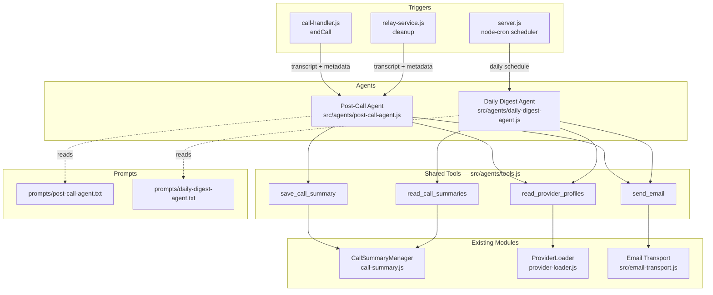

# Design Document: Provider Call Notification

## Overview

This feature replaces the standalone `generateSummary()` AI call in `call-summary.js` with an AI agent-driven post-call processing pipeline, and adds a daily digest email agent. Both agents use the Vercel AI SDK (`ai` package) for tool-calling orchestration, with all decision-making logic living in editable prompt files rather than application code.

The system introduces two agents:
1. **Post-Call Agent** — triggered after each call ends, absorbs summary generation, saves the summary via tool, optionally emails relevant providers.
2. **Daily Digest Agent** — triggered on a cron schedule, reads the day's summaries and composes a digest email to the admin.

Both agents share a common set of thin tool adapters (10-20 lines each) that wrap existing modules: `CallSummaryManager`, `ProviderLoader`, and a new `nodemailer` transport.

### Key Design Decisions

- **Vercel AI SDK over LangChain**: The `ai` package is lighter, has first-class OpenAI-compatible API support (which OpenRouter is), built-in tool calling with automatic loop handling, and less abstraction overhead. The project already uses the `openai` npm package for OpenRouter access.
- **CommonJS throughout**: The project uses `require`/`module.exports`. The Vercel AI SDK supports CommonJS.
- **Prompts on disk**: Agent behavior is defined in `prompts/post-call-agent.txt` and `prompts/daily-digest-agent.txt`, read from disk on each invocation. No restart needed to change behavior.
- **Post-call agent absorbs summary generation**: The current `generateSummary()` in `call-summary.js` is removed. The post-call agent receives the transcript, generates the summary, and saves it via the `save_call_summary` tool.
- **Tools are thin adapters**: Each tool is 10-20 lines wrapping an existing module method.

## Architecture



### Flow: Post-Call Agent

1. Call ends → `call-handler.js` or `relay-service.js` calls `runPostCallAgent(callData)` asynchronously (fire-and-forget with error logging).
2. `post-call-agent.js` reads `prompts/post-call-agent.txt` from disk.
3. Creates a Vercel AI SDK `generateText()` call with the prompt, transcript, and call metadata as the user message, plus the three tools: `save_call_summary`, `read_provider_profiles`, `send_email`.
4. The SDK handles the tool-calling loop automatically — the agent decides what to do based on prompt instructions.
5. If SMTP is not configured, the `send_email` tool returns an error message to the agent, which skips email.

### Flow: Daily Digest Agent

1. `node-cron` fires at the configured hour (default 18:00 Pacific).
2. `daily-digest-agent.js` reads `prompts/daily-digest-agent.txt` from disk.
3. Creates a `generateText()` call with the admin email address as context, plus tools: `read_call_summaries`, `read_provider_profiles`, `send_email`.
4. The agent reads today's summaries, composes a digest, and sends it.

## Components and Interfaces

### New Files

#### `src/agents/tools.js` — Shared Tool Definitions

Exports an object (or function) that returns Vercel AI SDK tool definitions. Each tool is a thin adapter wrapping an existing module.

```js
// src/agents/tools.js
const { tool } = require('ai');
const { z } = require('zod');
const callSummaryManager = require('../call-summary');
const providerLoader = require('../provider-loader');
const emailTransport = require('../email-transport');

function createTools(options = {}) {
  const tools = {
    save_call_summary: tool({
      description: 'Save a call summary to disk as a JSON file',
      parameters: z.object({
        callSid: z.string(),
        callerPhone: z.string(),
        twilioNumber: z.string(),
        startTime: z.string(),
        endTime: z.string(),
        duration: z.string(),
        summary: z.string(),
        fullTranscript: z.array(z.object({
          speaker: z.string(),
          message: z.string()
        }))
      }),
      execute: async (params) => {
        const filepath = callSummaryManager.saveSummaryDirect(params);
        return { success: true, filepath };
      }
    }),

    read_provider_profiles: tool({
      description: 'Read all provider profiles including name, email, phone, specialties',
      parameters: z.object({}),
      execute: async () => {
        return providerLoader.getAll();
      }
    }),

    read_call_summaries: tool({
      description: 'Read call summaries, optionally filtered by date',
      parameters: z.object({
        date: z.string().optional().describe('ISO date string (YYYY-MM-DD) to filter summaries')
      }),
      execute: async ({ date }) => {
        const summaries = callSummaryManager.getAllSummaries();
        if (date) {
          return summaries.filter(s => s.startTime && s.startTime.startsWith(date));
        }
        return summaries;
      }
    }),

    send_email: tool({
      description: 'Send an email to a recipient',
      parameters: z.object({
        to: z.string().describe('Recipient email address'),
        subject: z.string().describe('Email subject line'),
        body: z.string().describe('Email body text')
      }),
      execute: async ({ to, subject, body }) => {
        if (!to || to.trim() === '') {
          return { success: false, error: 'Recipient email address is missing or empty' };
        }
        if (!emailTransport.isConfigured()) {
          return { success: false, error: 'Email is not configured (SMTP settings missing)' };
        }
        try {
          await emailTransport.sendMail({ to, subject, body });
          return { success: true };
        } catch (err) {
          return { success: false, error: `Failed to send email: ${err.message}` };
        }
      }
    })
  };

  // If SMTP not configured, exclude send_email or let it return error
  // We keep it available so the agent gets a clear error message
  return tools;
}

module.exports = { createTools };
```

#### `src/agents/post-call-agent.js` — Post-Call Agent

```js
// src/agents/post-call-agent.js
const fs = require('fs');
const path = require('path');
const { generateText } = require('ai');
const { createOpenAI } = require('@ai-sdk/openai');
const config = require('../config');
const { createTools } = require('./tools');

const PROMPT_PATH = path.join(__dirname, '..', '..', 'prompts', 'post-call-agent.txt');

async function runPostCallAgent(callData) {
  // Read prompt from disk on each invocation
  let promptInstructions;
  try {
    promptInstructions = fs.readFileSync(PROMPT_PATH, 'utf-8').trim();
  } catch (err) {
    console.error('❌ Failed to read post-call agent prompt:', err.message);
    throw err;
  }

  const openai = createOpenAI({
    baseURL: 'https://openrouter.ai/api/v1',
    apiKey: config.openRouter.apiKey,
  });

  const tools = createTools();

  // Build user message with call data
  const userMessage = `Call has ended. Here is the call data:

Call SID: ${callData.callSid}
Caller Phone: ${callData.from}
Twilio Number: ${callData.to}
Start Time: ${callData.startTime}
End Time: ${callData.endTime}

Conversation Transcript:
${callData.conversationHistory.map(m =>
  `${m.role === 'user' ? 'Caller' : 'AI Receptionist'}: ${m.content}`
).join('\n')}`;

  const result = await generateText({
    model: openai(config.openRouter.model),
    system: promptInstructions,
    prompt: userMessage,
    tools,
    maxSteps: 10,
  });

  return result;
}

module.exports = { runPostCallAgent };
```

#### `src/agents/daily-digest-agent.js` — Daily Digest Agent

```js
// src/agents/daily-digest-agent.js
const fs = require('fs');
const path = require('path');
const { generateText } = require('ai');
const { createOpenAI } = require('@ai-sdk/openai');
const config = require('../config');
const { createTools } = require('./tools');

const PROMPT_PATH = path.join(__dirname, '..', '..', 'prompts', 'daily-digest-agent.txt');

async function runDailyDigestAgent(adminEmail) {
  let promptInstructions;
  try {
    promptInstructions = fs.readFileSync(PROMPT_PATH, 'utf-8').trim();
  } catch (err) {
    console.error('❌ Failed to read daily digest agent prompt:', err.message);
    throw err;
  }

  const openai = createOpenAI({
    baseURL: 'https://openrouter.ai/api/v1',
    apiKey: config.openRouter.apiKey,
  });

  const tools = createTools();

  const today = new Date().toISOString().split('T')[0]; // YYYY-MM-DD

  const userMessage = `It is now time to generate the daily digest.
Today's date: ${today}
Admin email: ${adminEmail}

Please read today's call summaries, review them, and compose a digest email to send to the admin.`;

  const result = await generateText({
    model: openai(config.openRouter.model),
    system: promptInstructions,
    prompt: userMessage,
    tools,
    maxSteps: 10,
  });

  return result;
}

module.exports = { runDailyDigestAgent };
```

#### `src/email-transport.js` — Nodemailer SMTP Setup

```js
// src/email-transport.js
const nodemailer = require('nodemailer');

let transporter = null;
let configured = false;
let fromAddress = null;

function initialize() {
  const host = process.env.SMTP_HOST;
  const port = process.env.SMTP_PORT;
  const user = process.env.SMTP_USER;
  const pass = process.env.SMTP_PASS;
  const from = process.env.SMTP_FROM;

  if (!host || !port || !user || !pass || !from) {
    console.warn('⚠️ SMTP not fully configured — email notifications disabled');
    configured = false;
    return;
  }

  try {
    transporter = nodemailer.createTransport({
      host,
      port: parseInt(port, 10),
      secure: true, // TLS
      auth: { user, pass }
    });
    fromAddress = from;
    configured = true;
    console.log('📧 SMTP email transport configured');
  } catch (err) {
    console.error('❌ SMTP configuration failed:', err.message);
    configured = false;
  }
}

function isConfigured() {
  return configured;
}

async function sendMail({ to, subject, body }) {
  if (!configured || !transporter) {
    throw new Error('Email transport is not configured');
  }
  return transporter.sendMail({
    from: fromAddress,
    to,
    subject,
    text: body
  });
}

module.exports = { initialize, isConfigured, sendMail };
```

#### `prompts/post-call-agent.txt` — Post-Call Agent Instructions

A text file containing instructions for the post-call agent. Defines how to generate summaries, when to notify providers, and how to compose notification emails. Read from disk on each invocation.

#### `prompts/daily-digest-agent.txt` — Daily Digest Agent Instructions

A text file containing instructions for the daily digest agent. Defines how to compose the digest, what to include, and when to skip sending. Read from disk on each invocation.

### Modified Files

#### `src/call-summary.js`

- **Remove**: `generateSummary()` method (AI call is now handled by the post-call agent).
- **Add**: `saveSummaryDirect(summaryData)` method that accepts a pre-built summary object and writes it to disk. This is the thin adapter target for the `save_call_summary` tool.
- **Keep**: All file I/O methods (`getAllSummaries`, `getSummariesPaginated`, `getSummaryById`, `deleteSummaryById`, `deleteAllSummaries`).
- **Keep**: `saveCallSummary()` as a fallback for when the agent system is unavailable.

#### `src/call-handler.js`

- **Change**: `endCall()` method to call `runPostCallAgent()` instead of `callSummary.saveCallSummary()` directly.
- The agent call is fire-and-forget (async, errors logged but don't block teardown).
- If the agent fails, fall back to saving a basic summary without AI generation.

#### `src/realtime/relay-service.js`

- **Change**: `cleanup()` method to call `runPostCallAgent()` instead of `callSummary.saveCallSummary()` directly.
- Same fire-and-forget pattern with fallback.

#### `src/config.js`

- **Add**: SMTP configuration block (`smtp.host`, `smtp.port`, `smtp.user`, `smtp.pass`, `smtp.from`).
- **Add**: `adminEmail` from `ADMIN_EMAIL` env var.
- **Add**: `digestScheduleHour` from `DIGEST_SCHEDULE_HOUR` env var (default: 18).

#### `src/server.js`

- **Add**: Import and initialize `email-transport.js` at startup.
- **Add**: Daily digest scheduling using `node-cron` (or `setInterval` with hour check).
- **Add**: Startup logging for notification system status (SMTP configured, digest schedule, prompt file existence).
- **Add**: Verify prompt files exist at startup, log warnings for missing files.

## Data Models

### Call Data (passed to Post-Call Agent)

```js
{
  callSid: 'CA9a4c2121...',       // Twilio Call SID
  from: '+14255551234',            // Caller phone number
  to: '+14255279017',              // Twilio number
  startTime: '2026-02-14T22:18:42.308Z',
  endTime: '2026-02-14T22:20:15.366Z',
  conversationHistory: [
    { role: 'user', content: 'Hello...' },
    { role: 'assistant', content: 'Thank you for calling...' }
  ]
}
```

### Call Summary (saved by `save_call_summary` tool)

Same shape as existing summaries in `call-summaries/`:

```js
{
  callSid: 'CA9a4c2121...',
  callerPhone: '+14255551234',
  twilioNumber: '+14255279017',
  startTime: '2026-02-14T22:18:42.308Z',
  endTime: '2026-02-14T22:20:15.366Z',
  duration: '93 seconds',
  summary: 'The caller was looking for...',
  fullTranscript: [
    { speaker: 'Caller', message: 'Hello...' },
    { speaker: 'AI Receptionist', message: 'Thank you...' }
  ]
}
```

### Email Parameters (passed to `send_email` tool)

```js
{
  to: 'provider@example.com',
  subject: 'New call regarding your services',
  body: 'A caller at +14255551234 called at 2:18 PM...'
}
```

### Config Additions

```js
// Added to config.js
smtp: {
  host: process.env.SMTP_HOST || null,
  port: process.env.SMTP_PORT || null,
  user: process.env.SMTP_USER || null,
  pass: process.env.SMTP_PASS || null,
  from: process.env.SMTP_FROM || null,
},
adminEmail: process.env.ADMIN_EMAIL || null,
digestScheduleHour: parseInt(process.env.DIGEST_SCHEDULE_HOUR || '18', 10),
```

### New Dependencies

```json
{
  "ai": "^4.x",
  "@ai-sdk/openai": "^1.x",
  "nodemailer": "^6.x",
  "node-cron": "^3.x",
  "zod": "^3.x"
}
```


## Correctness Properties

*A property is a characteristic or behavior that should hold true across all valid executions of a system — essentially, a formal statement about what the system should do. Properties serve as the bridge between human-readable specifications and machine-verifiable correctness guarantees.*

### Property 1: Call summary save round trip

*For any* valid call summary object (with callSid, callerPhone, twilioNumber, startTime, endTime, duration, summary text, and fullTranscript array), saving it via the `save_call_summary` tool and then reading it back from disk should produce an object with identical field values.

**Validates: Requirements 1.1**

### Property 2: Provider profiles adapter transparency

*For any* set of provider markdown files loaded into the ProviderLoader, the `read_provider_profiles` tool should return data identical to what `providerLoader.getAll()` returns directly.

**Validates: Requirements 1.2**

### Property 3: Call summaries date filtering and sort order

*For any* collection of call summaries with various startTime dates, and any date filter string, the `read_call_summaries` tool should return only summaries whose startTime starts with that date string, and the returned array should be sorted by startTime in descending order.

**Validates: Requirements 1.3**

### Property 4: Send email tool validates inputs and handles transport errors

*For any* string that is empty or composed entirely of whitespace, invoking the `send_email` tool with that string as the recipient should return an error result without attempting delivery. Additionally, *for any* transport error with an error message, the tool should return an error result containing that message.

**Validates: Requirements 1.5, 1.6**

### Property 5: Post-call agent receives complete call data

*For any* call data object containing callSid, from, to, startTime, endTime, and conversationHistory, the user message constructed for the post-call agent should contain all of these values as substrings.

**Validates: Requirements 2.1**

### Property 6: Prompt files are read fresh from disk on each invocation

*For any* prompt file path and any two distinct prompt contents, writing the first content to disk and invoking the agent setup should use the first content, then writing the second content and invoking again should use the second content — without any restart or cache invalidation.

**Validates: Requirements 2.4, 3.5, 4.3, 5.5**

### Property 7: Agent errors preserve call transcript

*For any* call data with a conversation transcript, if the post-call agent throws an error during execution, the original call data (including the full conversationHistory) should remain unmodified and available for fallback processing.

**Validates: Requirements 2.6**

### Property 8: SMTP configuration completeness determines email availability

*For any* subset of the five required SMTP environment variables (SMTP_HOST, SMTP_PORT, SMTP_USER, SMTP_PASS, SMTP_FROM), the email transport should report `isConfigured() === true` if and only if all five variables are present and non-empty.

**Validates: Requirements 6.1, 6.2**

### Property 9: Digest schedule hour is configurable

*For any* integer value between 0 and 23 set as `DIGEST_SCHEDULE_HOUR`, the daily digest scheduler should use that value as the trigger hour. When the variable is absent, it should default to 18.

**Validates: Requirements 4.7**

## Error Handling

### Post-Call Agent Errors

- The post-call agent is invoked asynchronously (fire-and-forget) from `call-handler.js` and `relay-service.js`.
- If the agent throws, the error is caught and logged with `console.error`.
- The original call data (transcript, metadata) is preserved in the catch block. A fallback path saves a basic summary (without AI-generated text) using the existing `saveCallSummary()` method so no call data is lost.
- The call teardown process is never blocked by agent errors.

### Daily Digest Agent Errors

- The digest agent runs inside a try/catch in the cron callback.
- Errors are logged but do not affect the main application or other scheduled tasks.
- The cron job continues to fire on subsequent days regardless of previous failures.

### Email Transport Errors

- If SMTP env vars are incomplete, `emailTransport.initialize()` sets `configured = false` and logs a warning. The `send_email` tool returns an error message to the agent.
- If `sendMail()` throws at runtime (e.g., SMTP server unreachable), the tool catches the error and returns it as a structured error result to the agent. The agent can then decide how to proceed based on its prompt instructions.
- SMTP initialization failures do not prevent the application from starting.

### Missing Prompt Files

- If a prompt file doesn't exist when an agent is invoked, the agent function throws, which is caught by the fire-and-forget wrapper. The error is logged.
- At startup, the system checks for prompt file existence and logs warnings for missing files, giving the operator a heads-up before any calls come in.

### Tool Execution Errors

- Each tool's `execute` function wraps its logic in try/catch and returns structured `{ success: false, error: '...' }` results rather than throwing. This lets the AI agent see the error and decide what to do next (retry, skip, etc.).

## Testing Strategy

### Property-Based Testing

Use `fast-check` (already in devDependencies) for property-based tests. Each property test runs a minimum of 100 iterations.

Each property test must be tagged with a comment referencing the design property:
```
// Feature: provider-call-notification, Property N: <property text>
```

Property tests focus on:
- **Property 1**: Generate random call summary objects, save via tool, read back, assert equality.
- **Property 2**: Generate random provider file sets, load them, call tool, assert output matches `getAll()`.
- **Property 3**: Generate random summary arrays with various dates, apply date filter, assert filtering correctness and descending sort order.
- **Property 4**: Generate random whitespace strings for empty-email validation; generate random Error objects for transport error forwarding.
- **Property 5**: Generate random call data objects, build the user message string, assert all field values appear as substrings.
- **Property 6**: Generate random prompt content pairs, write/read/assert fresh reads.
- **Property 7**: Generate random call data, simulate agent failure, assert call data is unmodified.
- **Property 8**: Generate random subsets of 5 SMTP env vars, initialize transport, assert `isConfigured()` matches completeness.
- **Property 9**: Generate random hours 0-23, set env var, assert scheduler uses that hour.

### Unit Testing

Unit tests complement property tests for specific examples and edge cases:
- Verify `send_email` tool with a valid email, subject, and body calls `sendMail` with correct params.
- Verify `save_call_summary` tool creates a file with the expected filename pattern.
- Verify `read_call_summaries` with no date filter returns all summaries.
- Verify daily digest is not scheduled when `ADMIN_EMAIL` is missing.
- Verify SMTP transport uses `secure: true` (TLS).
- Verify startup logs include notification system status messages.
- Verify post-call agent fallback saves a basic summary when agent throws.

### Test Configuration

- **Library**: `fast-check` ^4.5.3 (already installed)
- **Runner**: `vitest` (already configured)
- **Minimum iterations**: 100 per property test
- **Test location**: `tests/property/` for property tests, `tests/unit/` for unit tests
- **Mocking**: Mock `nodemailer` transport, mock `fs` for prompt file tests, mock AI SDK `generateText` to avoid real API calls in tests.
