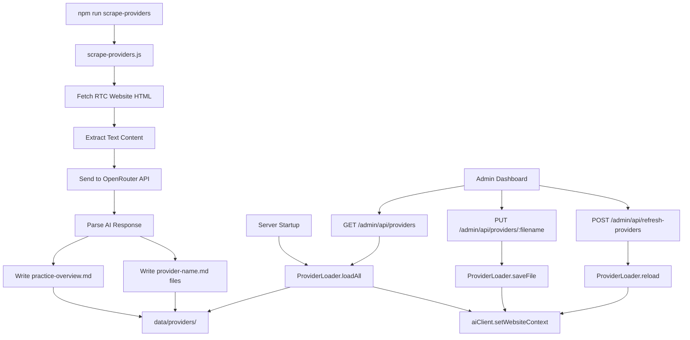

# Design Document: Provider Profile Scraping & Management

## Overview

This feature replaces the broken raw-text website scraping approach with an AI-powered pipeline that generates clean, structured markdown provider profiles. The system consists of four main parts:

1. A standalone scrape script that fetches the RTC website, sends content to OpenRouter, and writes markdown files
2. A ProviderLoader module (mirroring AvailabilityLoader) that loads/saves/serves provider markdown files
3. Updated AI context building that uses provider markdown instead of raw text
4. Admin dashboard UI and API endpoints for managing provider profiles

The existing `WebsiteScraper` class and `data/website-cache.json` are replaced by this new pipeline. The `website-scraper.js` module is retained only for the HTML fetching/text extraction logic, which the scrape script reuses.

## Architecture



## Components and Interfaces

### 1. Scrape Script (`src/scrape-providers.js`)

Standalone Node.js script, invoked via `npm run scrape-providers`.

```javascript
// Main flow (pseudocode)
async function main() {
  // 1. Fetch HTML from RTC website
  const html = await fetchWebsite(WEBSITE_URL);
  
  // 2. Extract text content (reuse cheerio-based extraction)
  const text = extractText(html);
  
  // 3. Send to OpenRouter with structured prompt
  const summaries = await generateSummaries(text);
  
  // 4. Write markdown files to data/providers/
  await writeProviderFiles(summaries);
}
```

The prompt sent to OpenRouter instructs the AI to return a JSON structure:
```json
{
  "practiceOverview": "# Practice Overview\n...",
  "providers": [
    { "name": "Miri Arie", "slug": "miri-arie", "content": "# Miri Arie\n..." }
  ]
}
```

### 2. Provider Loader (`src/provider-loader.js`)

Follows the exact same pattern as `src/availability-loader.js`:

```javascript
class ProviderLoader {
  constructor(providerDir)    // defaults to data/providers/
  ensureDirectory()           // creates dir if missing
  loadAll()                   // loads all .md files into Map
  getAll()                    // returns { filename: content } object
  getAIContext()              // returns combined markdown string
  getFile(filename)           // returns single file content or null
  saveFile(filename, content) // writes to disk + updates Map
  reload()                    // reloads all from disk
}
```

Exported as a singleton instance, same as availability-loader.

### 3. Server Integration (`src/server.js` changes)

- Import `providerLoader` instead of (or alongside) `WebsiteScraper`
- On startup: `providerLoader.loadAll()` → `aiClient.setWebsiteContext(providerLoader.getAIContext())`
- New API endpoints:
  - `GET /admin/api/providers` — list all provider files
  - `PUT /admin/api/providers/:filename` — save a provider file
  - `POST /admin/api/refresh-providers` — reload from disk + update context
- Update admin nav to include "Provider Profiles"
- Update reload endpoint to also reload providers

### 4. Admin Dashboard Page (`public/admin/providers.html`)

Follows the same pattern as `availability.html`:
- Nav with "Provider Profiles" active
- List of textareas, one per provider file
- Save button per file
- "New Provider Profile" form
- "Reload from Disk" button
- Uses `const UI = window.AdminUI;` pattern

### 5. AI Context Changes

The `aiClient.setWebsiteContext()` method remains unchanged — it accepts a string. The difference is the input: instead of raw scraped text from `websiteScraper.getAIContext()`, it receives clean markdown from `providerLoader.getAIContext()`.

The real-time relay's `initialize()` call also switches from `websiteScraper.getAIContext()` to `providerLoader.getAIContext()`.

## Data Models

### Provider File Structure

Each provider markdown file in `data/providers/` follows this structure:

```markdown
# Provider Name, Credentials

## About
Brief bio and background.

## Specialties
- Specialty 1
- Specialty 2

## Approach
Description of therapeutic approach.

## Contact
- Email: [email]
- Phone: [phone]
```

### Practice Overview File

`data/providers/practice-overview.md`:

```markdown
# Relational Therapy Collective (RTC)

## About
Practice description and mission.

## Location
Address and location details.

## Services
- Service 1
- Service 2

## Insurance
Accepted insurance information.
```

### ProviderLoader In-Memory State

```javascript
{
  files: Map<string, string>  // filename → markdown content
  providerDir: string         // absolute path to data/providers/
}
```

### Scrape Script AI Response Format

```json
{
  "practiceOverview": "string (markdown)",
  "providers": [
    {
      "name": "string",
      "slug": "string (kebab-case)",
      "content": "string (markdown)"
    }
  ]
}
```


## Correctness Properties

*A property is a characteristic or behavior that should hold true across all valid executions of a system — essentially, a formal statement about what the system should do. Properties serve as the bridge between human-readable specifications and machine-verifiable correctness guarantees.*

### Property 1: HTML text extraction excludes unwanted elements

*For any* HTML document containing script, style, nav, and footer elements with known text content, the extracted text SHALL NOT contain text from those elements, but SHALL contain text from other body elements.

**Validates: Requirements 1.2**

### Property 2: File count matches provider count plus one

*For any* valid AI response containing N provider objects and a practice overview, the scrape script SHALL write exactly N+1 markdown files to the providers directory (N provider files + 1 practice-overview.md).

**Validates: Requirements 1.4**

### Property 3: Provider name to kebab-case slug

*For any* provider name string, the generated filename slug SHALL be lowercase, use hyphens instead of spaces, strip non-alphanumeric characters (except hyphens), and end with `.md`.

**Validates: Requirements 1.5**

### Property 4: ProviderLoader load round-trip

*For any* set of `.md` files written to the provider directory, after calling `loadAll()`, `getAll()` SHALL return a map containing exactly those files with matching content, and `getFile(filename)` SHALL return the correct content for each file and `null` for any filename not in the set.

**Validates: Requirements 2.1, 2.2, 2.4, 2.5, 2.7**

### Property 5: getAIContext contains all file content

*For any* set of loaded provider files, the string returned by `getAIContext()` SHALL contain the content of every loaded file.

**Validates: Requirements 2.3**

### Property 6: saveFile round-trip

*For any* valid filename and content string, after calling `saveFile(filename, content)`, both `getFile(filename)` SHALL return the same content AND the file on disk SHALL contain the same content.

**Validates: Requirements 2.6**

### Property 7: Filename validation accepts only valid filenames

*For any* string, the filename validation function SHALL accept it if and only if it ends with `.md` and contains only letters, numbers, hyphens, underscores, and dots.

**Validates: Requirements 4.8**

### Property 8: API PUT/GET round-trip

*For any* valid provider filename and content, after a PUT to `/admin/api/providers/:filename`, a subsequent GET to `/admin/api/providers` SHALL include that file with the saved content.

**Validates: Requirements 5.2**

### Property 9: Filename .md normalization

*For any* filename string that does not end in `.md`, the server SHALL append `.md` before saving, so the resulting stored filename always ends with `.md`.

**Validates: Requirements 5.4**

## Error Handling

### Scrape Script Errors

| Error | Handling |
|-------|----------|
| Website fetch fails (network, timeout, HTTP error) | Log error with details, exit with code 1 |
| OpenRouter API call fails (auth, rate limit, timeout) | Log error with details, exit with code 1 |
| AI response is not valid JSON or missing expected fields | Log parsing error, exit with code 1 |
| File system write fails (permissions, disk full) | Log error with details, exit with code 1 |

### Provider Loader Errors

| Error | Handling |
|-------|----------|
| Provider directory missing | Create it automatically via `ensureDirectory()` |
| File read fails | Throw error (caller handles) |
| File write fails | Throw error (caller handles) |

### API Endpoint Errors

| Error | Handling |
|-------|----------|
| GET /admin/api/providers fails | Return 500 with error details JSON |
| PUT with empty content | Return 400 with "Content is required" message |
| PUT file write fails | Return 500 with error details JSON |
| POST refresh fails | Return 500 with error details JSON |

All API errors are logged to the error buffer via `errorBuffer.add()` for dashboard visibility.

## Testing Strategy

### Property-Based Testing

Use `fast-check` (already in the project) with `vitest` for property-based tests. Each property test runs a minimum of 100 iterations.

Tests go in `tests/property/`:

- `provider-loader.property.test.js` — Properties 4, 5, 6 (ProviderLoader round-trips and context building)
- `scrape-providers.property.test.js` — Properties 2, 3 (file count, slug generation)
- `filename-validation.property.test.js` — Property 7 (filename validation)

Each test is tagged with: **Feature: provider-profile-scraping, Property {N}: {title}**

### Unit Testing

Tests go in `tests/unit/`:

- `provider-loader.test.js` — Basic load/save/reload operations, directory creation edge case
- `scrape-providers.test.js` — HTML extraction (Property 1), AI response parsing, error handling edge cases
- `providers-api.test.js` — API endpoint behavior including Property 8, 9, error responses

Unit tests focus on:
- Specific examples demonstrating correct behavior
- Edge cases (empty directory, missing directory, invalid JSON from AI)
- Error conditions (network failures, file permission errors)
- Integration points between components

### Test Configuration

```javascript
// vitest.config.js already configured
// Property tests: minimum 100 iterations via fast-check numRuns
// Tag format in test descriptions:
// "Feature: provider-profile-scraping, Property 3: Provider name to kebab-case slug"
```
