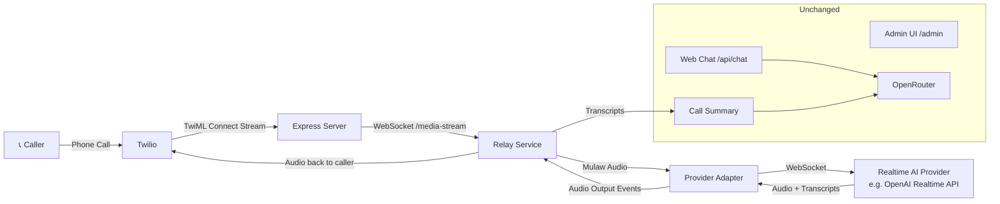
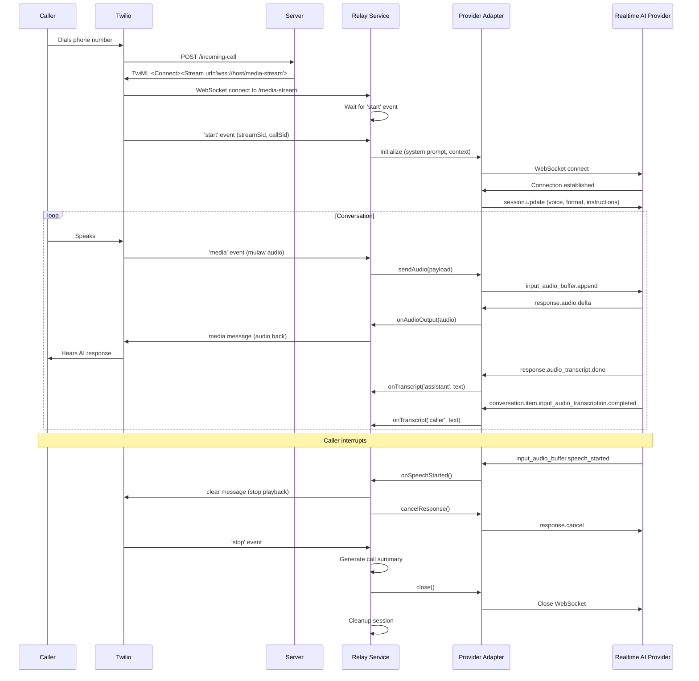

# Design Document: Realtime Voice Streaming

## Overview

This design upgrades the AI Phone Receptionist from Twilio's turn-based `<Gather>`/`<Say>` flow to real-time bidirectional audio streaming. The architecture introduces a Relay Service that bridges Twilio Media Streams with a pluggable Realtime AI Provider (initially OpenAI's Realtime API). The Relay Service sits between two WebSocket connections: one from Twilio carrying caller audio, and one to the AI provider carrying audio for processing. A Provider Adapter abstraction allows swapping AI providers without modifying relay logic.

The existing text-based flows (web chat via OpenRouter, admin UI, call summaries, prompt management, availability management) remain completely untouched. The upgrade only affects the voice call path.

## Architecture



### Call Flow Sequence



## Components and Interfaces

### 1. Config Updates (`src/config.js`)

Add new configuration fields for the realtime streaming feature:

```javascript
const config = {
  // ... existing config ...
  openai: {
    apiKey: process.env.OPENAI_API_KEY || null,
    realtimeVoice: process.env.OPENAI_REALTIME_VOICE || 'alloy'
  },
  realtime: {
    provider: process.env.REALTIME_AI_PROVIDER || 'openai'
  }
};
```

The `OPENAI_API_KEY` is not added to the required validation list — its absence triggers a graceful fallback to Gather-based calls.

### 2. Provider Adapter Interface (`src/realtime/provider-adapter.js`)

Abstract base class defining the contract all provider adapters must implement:

```javascript
class ProviderAdapter {
  /**
   * Open connection to the realtime AI provider.
   * @param {Object} options
   * @param {string} options.systemPrompt - System instructions
   * @param {string} options.websiteContext - Scraped website content
   * @param {string} options.availabilityContext - Provider availability info
   */
  async connect(options) { throw new Error('Not implemented'); }

  /**
   * Send audio input to the provider.
   * @param {string} audioPayload - Base64-encoded audio data
   */
  sendAudio(audioPayload) { throw new Error('Not implemented'); }

  /**
   * Cancel the current in-progress response.
   */
  cancelResponse() { throw new Error('Not implemented'); }

  /**
   * Close the provider connection.
   */
  close() { throw new Error('Not implemented'); }

  // Event callbacks (set by Relay Service)
  /** @type {function(string): void} Called with base64 audio chunk */
  onAudioOutput = null;
  /** @type {function(string, string): void} Called with (role, text) */
  onTranscript = null;
  /** @type {function(): void} Called when caller speech is detected */
  onSpeechStarted = null;
  /** @type {function(Error): void} Called on provider error */
  onError = null;
  /** @type {function(): void} Called when provider connection closes */
  onClose = null;
}
```

### 3. OpenAI Provider Adapter (`src/realtime/openai-adapter.js`)

Concrete implementation for OpenAI's Realtime API:

```javascript
class OpenAIAdapter extends ProviderAdapter {
  constructor(apiKey, voice) {
    super();
    this.apiKey = apiKey;
    this.voice = voice;
    this.ws = null;
  }

  async connect(options) {
    // Open WebSocket to wss://api.openai.com/v1/realtime?model=gpt-4o-realtime-preview-2024-12-17
    // On open: send session.update with voice, audio format, turn detection, instructions
    // Wire up message handlers to emit events via callbacks
  }

  sendAudio(audioPayload) {
    // Send { type: 'input_audio_buffer.append', audio: audioPayload }
  }

  cancelResponse() {
    // Send { type: 'response.cancel' }
  }

  close() {
    // Close WebSocket connection
  }
}
```

Key OpenAI session configuration:
- Model: `gpt-4o-realtime-preview-2024-12-17`
- Input audio format: `g711_ulaw` (Twilio's native format — no conversion needed)
- Output audio format: `g711_ulaw` (sent directly back to Twilio)
- Voice: configurable via `OPENAI_REALTIME_VOICE` (default: `alloy`)
- Turn detection: server VAD (voice activity detection) enabled
- Input audio transcription: enabled (model: `whisper-1`)
- Instructions: system prompt + website context + availability context

### 4. Provider Factory (`src/realtime/provider-factory.js`)

Factory function that instantiates the correct adapter based on configuration:

```javascript
function createProviderAdapter(providerName, config) {
  switch (providerName) {
    case 'openai':
      if (!config.openai.apiKey) return null;
      return new OpenAIAdapter(config.openai.apiKey, config.openai.realtimeVoice);
    default:
      console.warn(`Unknown realtime provider: ${providerName}`);
      return null;
  }
}
```

Returns `null` when the provider can't be initialized (missing API key, unknown provider), signaling the system to fall back to Gather-based calls.

### 5. Relay Service (`src/realtime/relay-service.js`)

Manages the bridge between a Twilio Media Stream WebSocket and a Provider Adapter for a single call session:

```javascript
class RelayService {
  constructor(twilioWs, providerAdapter, callSid, streamSid) {
    this.twilioWs = twilioWs;
    this.provider = providerAdapter;
    this.callSid = callSid;
    this.streamSid = streamSid;
    this.conversationHistory = []; // { role: 'caller'|'assistant', text: string }
    this.closed = false;
  }

  async initialize(options) {
    // Wire provider callbacks
    this.provider.onAudioOutput = (audio) => this.sendAudioToTwilio(audio);
    this.provider.onTranscript = (role, text) => this.addTranscript(role, text);
    this.provider.onSpeechStarted = () => this.handleInterruption();
    this.provider.onError = (err) => this.handleProviderError(err);
    this.provider.onClose = () => this.handleProviderClose();

    // Connect to AI provider
    await this.provider.connect(options);
  }

  handleTwilioMedia(audioPayload) {
    this.provider.sendAudio(audioPayload);
  }

  sendAudioToTwilio(audio) {
    // Send Twilio media message: { event: 'media', streamSid, media: { payload: audio } }
  }

  handleInterruption() {
    // Send clear to Twilio: { event: 'clear', streamSid }
    this.provider.cancelResponse();
  }

  addTranscript(role, text) {
    this.conversationHistory.push({ role, text });
  }

  async cleanup() {
    if (this.closed) return;
    this.closed = true;
    this.provider.close();
    // Generate call summary from conversationHistory
    // Remove session from active sessions map
  }
}
```

### 6. Session Manager (`src/realtime/session-manager.js`)

Tracks active streaming sessions:

```javascript
class SessionManager {
  constructor() {
    this.sessions = new Map(); // streamSid -> RelayService
  }

  addSession(streamSid, relayService) {
    this.sessions.set(streamSid, relayService);
  }

  getSession(streamSid) {
    return this.sessions.get(streamSid) || null;
  }

  removeSession(streamSid) {
    this.sessions.delete(streamSid);
  }

  getActiveCount() {
    return this.sessions.size;
  }
}
```

### 7. Server Changes (`src/server.js`)

Modifications to the existing server:

**Incoming call handler** — conditionally returns streaming TwiML or Gather TwiML:

```javascript
app.post('/incoming-call', (req, res) => {
  const callSid = req.body.CallSid;
  const from = req.body.From;

  if (realtimeAvailable) {
    // Return streaming TwiML
    const host = req.headers.host;
    const twiml = `<?xml version="1.0" encoding="UTF-8"?>
<Response>
  <Connect>
    <Stream url="wss://${host}/media-stream">
      <Parameter name="callSid" value="${callSid}" />
    </Stream>
  </Connect>
</Response>`;
    res.type('text/xml');
    res.send(twiml);
  } else {
    // Existing Gather-based TwiML (unchanged)
  }
});
```

**WebSocket handler** — replace the stub with real relay logic:

```javascript
wss.on('connection', (ws) => {
  let relay = null;

  ws.on('message', async (message) => {
    const data = JSON.parse(message);

    switch (data.event) {
      case 'start':
        const callSid = data.start.customParameters?.callSid || data.start.callSid;
        const streamSid = data.start.streamSid;
        const adapter = createProviderAdapter(config.realtime.provider, config);
        relay = new RelayService(ws, adapter, callSid, streamSid);
        sessionManager.addSession(streamSid, relay);
        await relay.initialize({ systemPrompt, websiteContext, availabilityContext });
        break;

      case 'media':
        if (relay) relay.handleTwilioMedia(data.media.payload);
        break;

      case 'stop':
        if (relay) await relay.cleanup();
        break;
    }
  });

  ws.on('close', async () => {
    if (relay) await relay.cleanup();
  });
});
```

### 8. Call Summary Integration

When a streaming session ends, the Relay Service converts its `conversationHistory` array into the format expected by `call-summary.js`:

```javascript
// Convert relay transcript to the format call-summary expects
const formattedHistory = [
  { role: 'system', content: systemPrompt },
  ...this.conversationHistory.map(entry => ({
    role: entry.role === 'caller' ? 'user' : 'assistant',
    content: entry.text
  }))
];

await callSummary.saveCallSummary({
  callSid: this.callSid,
  from: callerInfo.from,
  to: callerInfo.to,
  startTime: this.startTime,
  endTime: new Date().toISOString(),
  conversationHistory: formattedHistory
});
```

This reuses the existing `callSummary.saveCallSummary()` which generates the AI summary via OpenRouter.

## Data Models

### Session State

```javascript
{
  callSid: string,          // Twilio Call SID
  streamSid: string,        // Twilio Stream SID
  twilioWs: WebSocket,      // Twilio Media Stream WebSocket
  provider: ProviderAdapter, // Active provider adapter instance
  conversationHistory: [     // Captured transcripts
    { role: 'caller' | 'assistant', text: string }
  ],
  startTime: string,         // ISO timestamp
  callerInfo: {              // From Twilio start event
    from: string,
    to: string
  },
  closed: boolean            // Whether cleanup has been performed
}
```

### Provider Adapter Events

| Event | Payload | Description |
|-------|---------|-------------|
| `onAudioOutput` | `string` (base64 audio) | AI-generated audio chunk to send to caller |
| `onTranscript` | `(role: string, text: string)` | Completed transcript segment |
| `onSpeechStarted` | none | Caller started speaking (for interruption) |
| `onError` | `Error` | Provider-side error |
| `onClose` | none | Provider connection closed |

### Twilio Media Stream Messages

**Inbound (from Twilio):**
- `start`: `{ streamSid, callSid, customParameters, mediaFormat: { encoding, sampleRate, channels } }`
- `media`: `{ payload: string }` (base64 mulaw audio)
- `stop`: `{}`

**Outbound (to Twilio):**
- `media`: `{ event: 'media', streamSid, media: { payload: string } }` (base64 audio)
- `clear`: `{ event: 'clear', streamSid }` (stop current playback)


## Correctness Properties

*A property is a characteristic or behavior that should hold true across all valid executions of a system — essentially, a formal statement about what the system should do. Properties serve as the bridge between human-readable specifications and machine-verifiable correctness guarantees.*

### Property 1: Streaming TwiML generation correctness

*For any* valid Call_SID string and Host header string, when the realtime provider is available, the TwiML response from `/incoming-call` SHALL contain a `<Connect><Stream>` element where the `url` attribute starts with `wss://`, includes the Host value, ends with `/media-stream`, and contains a `<Parameter>` element with `name="callSid"` and `value` equal to the Call_SID.

**Validates: Requirements 1.1, 1.2, 1.3**

### Property 2: Session initialization from start event

*For any* valid Twilio `start` event containing a streamSid and callSid, when the Relay Service processes it, a Session SHALL be created in the Session Manager keyed by the streamSid, and the Session SHALL contain the correct callSid.

**Validates: Requirements 2.2**

### Property 3: Audio forwarding to provider

*For any* base64-encoded audio payload received in a Twilio `media` event, the Relay Service SHALL forward the exact same payload to the Provider Adapter's `sendAudio` method without modification.

**Validates: Requirements 2.3, 5.1**

### Property 4: Provider factory selection

*For any* provider name string, the provider factory SHALL return an OpenAI adapter when the name is `'openai'` and the API key is present, return `null` when the API key is missing, and return `null` for any unrecognized provider name. When no provider name is specified, it SHALL default to `'openai'`.

**Validates: Requirements 3.3, 8.3**

### Property 5: Context passing to provider

*For any* combination of system prompt string, website context string, and availability context string, when the Relay Service initializes a session, it SHALL pass all three strings to the Provider Adapter's `connect` method in the options object.

**Validates: Requirements 3.4**

### Property 6: OpenAI session.update message structure

*For any* voice setting string and system instructions string, the OpenAI adapter's session.update message SHALL contain the correct `voice` field, `input_audio_format` set to `g711_ulaw`, `output_audio_format` set to `g711_ulaw`, `input_audio_transcription` enabled, and `instructions` containing the system instructions.

**Validates: Requirements 4.2**

### Property 7: OpenAI audio input message encoding

*For any* base64-encoded audio string, the OpenAI adapter SHALL produce a JSON message with `type` equal to `input_audio_buffer.append` and `audio` equal to the input string.

**Validates: Requirements 4.3**

### Property 8: Twilio media message formatting

*For any* base64-encoded audio string and any streamSid string, the Relay Service SHALL produce a JSON message with `event` equal to `media`, `streamSid` equal to the provided streamSid, and `media.payload` equal to the audio string.

**Validates: Requirements 5.2**

### Property 9: Transcript storage preserves order and content

*For any* sequence of transcript events (each with a role of `'caller'` or `'assistant'` and arbitrary text), after all events are processed by the Relay Service, the Session's conversation history SHALL contain exactly those entries in the same order they were received, with matching roles and text.

**Validates: Requirements 6.1, 6.2, 6.3**

### Property 10: Gather fallback when realtime unavailable

*For any* valid Call_SID and Host header, when the realtime provider is NOT available (no API key configured), the TwiML response from `/incoming-call` SHALL contain a `<Gather>` element and SHALL NOT contain a `<Connect><Stream>` element.

**Validates: Requirements 9.5**

### Property 11: Session cleanup removes all references

*For any* streamSid that has an active Session in the Session Manager, after the Relay Service's `cleanup()` method is called for that session, the Session Manager SHALL no longer contain an entry for that streamSid.

**Validates: Requirements 10.4**

### Property 12: Streaming errors added to error buffer

*For any* Error object emitted by the Provider Adapter during an active Session, the error SHALL be added to the in-memory error buffer with the Session's Call_SID in the context field.

**Validates: Requirements 11.3**

## Error Handling

### Provider Connection Failures

When the Provider Adapter fails to connect (network error, invalid API key, service unavailable):
1. The adapter emits an `onError` event
2. The Relay Service logs the error with the Call_SID
3. The Relay Service adds the error to the error buffer
4. The Relay Service closes the Twilio WebSocket (which ends the call from Twilio's side)
5. The Session is cleaned up

### Mid-Call Provider Disconnection

When the Provider Adapter's WebSocket closes unexpectedly during a call:
1. The adapter emits an `onClose` event
2. The Relay Service attempts to generate a call summary from any captured transcripts
3. The Relay Service closes the Twilio WebSocket
4. The Session is cleaned up

### Twilio WebSocket Disconnection

When the Twilio WebSocket closes (caller hangs up, network issue):
1. The `ws.on('close')` handler fires
2. The Relay Service calls `cleanup()` which closes the Provider Adapter connection
3. A call summary is generated from captured transcripts
4. The Session is removed from the Session Manager

### Idempotent Cleanup

The `cleanup()` method uses a `closed` boolean flag to ensure it only runs once, even if triggered by multiple events (e.g., both Twilio close and provider close fire simultaneously).

### Startup Without API Key

When `OPENAI_API_KEY` is not set:
1. `config.openai.apiKey` is `null`
2. The provider factory returns `null`
3. A `realtimeAvailable` flag is set to `false`
4. A warning is logged: "⚠️ OPENAI_API_KEY not set — real-time voice streaming unavailable, using Gather fallback"
5. All incoming calls use the existing Gather/Say TwiML flow
6. All other features (web chat, admin UI, etc.) work normally

## Testing Strategy

### Testing Framework

- **Unit tests**: vitest (already configured)
- **Property-based tests**: fast-check (already installed)
- **Test file patterns**: `tests/unit/*.test.js` and `tests/property/*.property.test.js`

### Dual Testing Approach

**Unit tests** cover:
- Specific examples of TwiML generation (streaming vs. Gather)
- OpenAI adapter event handling (mock WebSocket messages → callback invocations)
- Interruption flow (speech-started → clear + cancel)
- Session cleanup behavior (normal and abnormal termination)
- Call summary integration with streaming transcripts
- Configuration loading with and without API keys
- Edge cases: empty transcripts, missing parameters, double cleanup

**Property-based tests** cover:
- TwiML generation correctness across all valid inputs (Property 1, 10)
- Audio forwarding integrity (Property 3)
- Provider factory behavior across all provider names (Property 4)
- Message encoding/formatting (Properties 6, 7, 8)
- Transcript storage ordering (Property 9)
- Session cleanup completeness (Property 11)
- Error buffer population (Property 12)

### Property-Based Testing Configuration

- Library: `fast-check` (v4.5.3, already installed)
- Minimum 100 iterations per property test
- Each test tagged with: **Feature: realtime-voice-streaming, Property {N}: {title}**
- Each correctness property implemented as a single property-based test

### Test Organization

```
tests/
├── unit/
│   ├── relay-service.test.js      # Relay service unit tests
│   ├── openai-adapter.test.js     # OpenAI adapter event handling
│   ├── provider-factory.test.js   # Factory function tests
│   └── session-manager.test.js    # Session manager tests
├── property/
│   ├── twiml-generation.property.test.js    # Properties 1, 10
│   ├── audio-relay.property.test.js         # Properties 3, 8
│   ├── provider-factory.property.test.js    # Property 4
│   ├── openai-messages.property.test.js     # Properties 6, 7
│   ├── transcript.property.test.js          # Property 9
│   └── session-cleanup.property.test.js     # Properties 11, 12
```

### Mocking Strategy

- **Twilio WebSocket**: Mock `ws` WebSocket objects with `send()` and `close()` methods
- **OpenAI WebSocket**: Mock WebSocket that can simulate incoming events (audio deltas, transcripts, errors)
- **Provider Adapter**: For relay service tests, use a mock adapter implementing the common interface
- **Call Summary**: Mock `call-summary.js` to verify it's called with correct arguments without hitting OpenRouter
- **Config**: Override `process.env` values in tests to simulate different configurations
